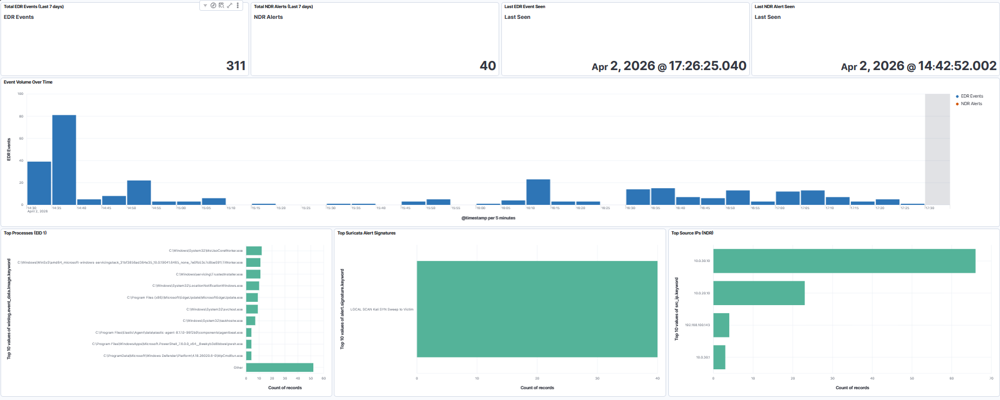
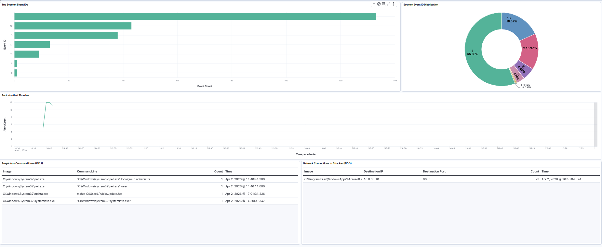
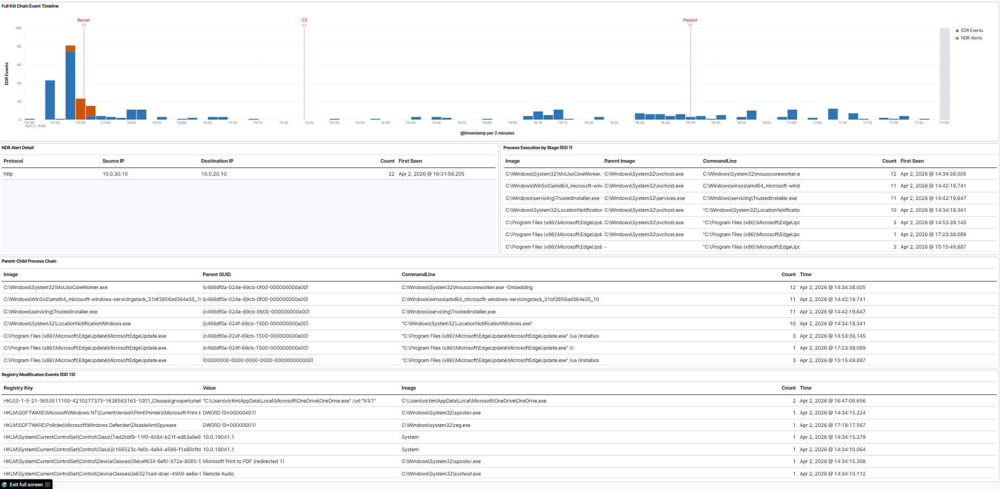
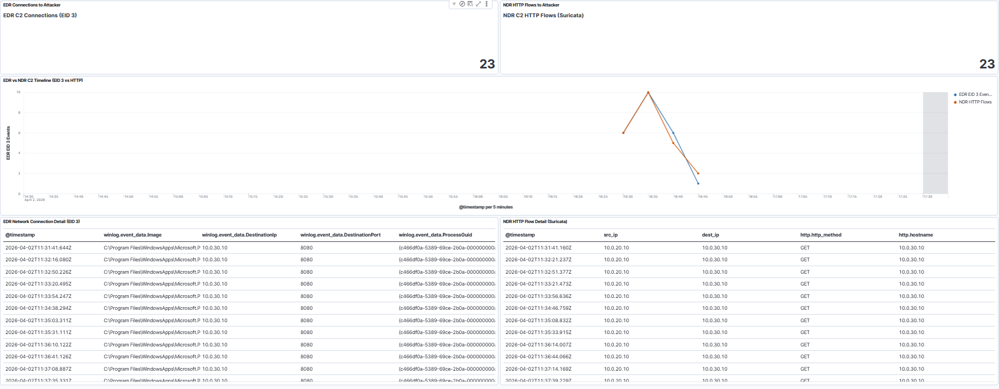
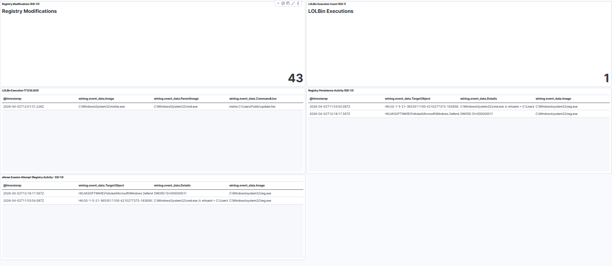

# Kibana Dashboards

Five dashboards built in Kibana 8.17.0 as part of Phase 9 of the SOC Homelab project. Each dashboard is a purpose-built analyst tool covering a specific layer of the April 2, 2026 kill chain simulation. Together they take a reviewer from situational awareness down to raw forensic evidence in five steps.

The dashboards are exported as a single NDJSON file and can be imported into any compatible Kibana instance via Stack Management, Saved Objects, Import.

Export: [dashboards/kibana-dashboards.ndjson](dashboards/kibana-dashboards.ndjson)

---

## Dashboard Index

| # | Name | What It Proves | Time Filter |
|---|------|---------------|-------------|
| 1 | SOC Overview | Both pipelines are operational and producing signal | Last 24 hours |
| 2 | Threat Activity (Triage) | Detection rules fired on real attack activity | Last 24 hours |
| 3 | Kill Chain Timeline | Full attack progression across a 3-hour window with stage annotations | 2026-04-02 14:30 to 17:30 |
| 4 | Cross-Layer Correlation | 23 EDR events = 23 NDR records, two independent sensors, no shared pipeline | 2026-04-02 14:41 to 17:18 |
| 5 | Persistence and Evasion | Run key, LOLBin execution chain, and Defender registry tamper mapped to MITRE | 2026-04-02 16:30 to 17:30 |

---

## Dashboard 1: SOC Overview

This is the first dashboard a reviewer sees. It answers one question: is anything happening right now? Four metric panels show total EDR events, total NDR alerts, and the timestamp of the last event seen from each pipeline. If both freshness indicators show recent activity, the lab is alive.

The central bar chart shows event volume over time across both pipelines layered together. EDR in blue, NDR in orange. During the April 2 kill chain the spike between 14:41 and 17:18 is visible immediately without any filtering. Below the chart, top processes by execution count, top Suricata alert signatures, and top source IPs give a quick read on what is driving the volume.

Time filter: Last 24 hours. Data views: logs-* and filebeat-*.

---

## Dashboard 2: Threat Activity (Triage)

This dashboard is built for a Tier 1 analyst doing a morning review. It surfaces which detection rules fired, which Sysmon event types dominated, and which command lines appeared suspicious, without requiring the analyst to write a single query.

Panel 2.1 shows detection rule trigger counts by rule name. During the kill chain, LOLBin-related rules dominate. Panel 2.2 breaks down Sysmon event ID distribution as a donut chart. EID 1 (process creation), EID 3 (network connection), and EID 13 (registry modification) are the three key types and all three are visible. Panel 2.3 shows the Suricata alert timeline as a line chart with a sharp spike at 14:41 when the Nmap scan fired SID 9000001. Panels 2.4 and 2.5 are raw command line tables showing LOLBin executions and victim-to-attacker C2 connections respectively.

Time filter: Last 24 hours. Data view: logs-*.

---

## Dashboard 3: Kill Chain Timeline

This dashboard tells the attack as a story. The top panel is a stacked bar chart covering the full 3-hour kill chain window with three annotations marking the exact moments each phase began: Recon at 14:41:40 when SID 9000001 fired, C2 at approximately 15:25 when beaconing started, and Persist at approximately 16:41 when the Run key was written.

Below the timeline, four supporting tables give the analyst the raw evidence behind each spike. The process execution table shows every LOLBin and recon binary in chronological order. The NDR alert detail table shows Suricata records from both directions. The registry modification table shows the two critical EID 13 events: the Run key write and the Defender policy modification. The parent-child process chain table shows the ProcessGuid pivot used in IR-005 to attribute the mshta.exe execution back to the operator session.

A reviewer can scroll this dashboard top to bottom and follow the full attack without opening a single IR report.

Time filter: 2026-04-02 14:30 to 17:30. Data views: logs-* and filebeat-*.

---

## Dashboard 4: Cross-Layer Correlation

This is the portfolio centrepiece. It proves that two independent sensors, with no shared data path, observed the same C2 activity.

The top row shows two metric panels side by side. Left: 23 Sysmon EID 3 (NetworkConnect) events from DESKTOP-MM1REM9 to 10.0.30.10, collected by Elastic Agent through the EDR pipeline. Right: 23 Suricata HTTP flow records from 10.0.20.10 to 10.0.30.10, collected by a standalone Filebeat binary on pfSense FreeBSD through the NDR pipeline. The two sensors share no agent, no log format, and no data path. Both arrived at 23 independently.

The middle panel overlays both timelines as a line chart. EDR in blue, NDR in orange. The lines track the same pattern across the C2 beaconing window. The bottom row shows the raw event tables from each source so a reviewer can verify the individual records without leaving the dashboard.

One sentence explains what this dashboard proves: if you can see the same event from two completely separate sensors, you have real detection coverage, not a single point of failure.

Time filter: 2026-04-02 14:41 to 17:18. Data views: logs-* and filebeat-*.

---

## Dashboard 5: Persistence and Evasion

This dashboard closes the kill chain by documenting what the attacker left behind. It covers the IR-004 window: LOLBin execution, registry-based persistence, and an attempt to weaken Defender through a direct registry modification.

Panel 5.1 counts registry modification events in the window. EID 13 in normal baseline operation is near zero. Any non-zero count during an attack window requires explanation. Panel 5.2 counts LOLBin executions filtered to mshta.exe, certutil.exe, and regsvr32.exe. Panel 5.3 is a raw execution table showing the full LOLBin chain in chronological order with parent process and command line visible for each entry.

Panel 5.4 isolates Run key writes. The single row shows the exact registry path written, the value pointing to the mshta.exe payload, and the process that performed the write. This is T1547.001 in a single table row. Panel 5.5 isolates Defender-related registry modifications. The row shows the HKLM\SOFTWARE\Policies\Microsoft\Windows Defender path written by reg.exe, which is T1562.001 executed without dropping a single piece of custom malware.

Time filter: 2026-04-02 16:30 to 17:30. Data view: logs-*.

---

## The 23=23 Corroboration

Sysmon on DESKTOP-MM1REM9 recorded 23 EID 3 events to 10.0.30.10 via the EDR pipeline. Suricata on pfSense recorded 23 HTTP flow records from 10.0.20.10 to 10.0.30.10 via a completely separate NDR pipeline. Same IPs, same time window, same count. No shared agent, no shared log format, no shared transport. Dashboard 4 makes this visible in under 10 seconds.

---

## Import Instructions

1. Go to Kibana, Stack Management, Saved Objects
2. Click Import
3. Select dashboards/kibana-dashboards.ndjson
4. Enable overwrite if reimporting
5. Confirm import

After import, open each dashboard and set the time filter to the window listed in the index above before saving. Kibana defaults to Last 15 minutes on first open, which shows no data for the April 2 kill chain.

---

## Data Sources

| Data View | Index Pattern | Source | Pipeline |
|-----------|--------------|--------|----------|
| logs-* | logs-winlog.winlog-default | Sysmon via Elastic Agent | EDR |
| filebeat-* | filebeat-7.14.0-2026.04.02 | Suricata EVE JSON via Filebeat | NDR |
