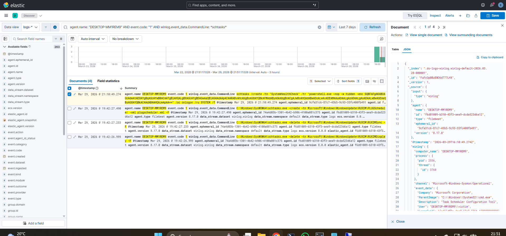
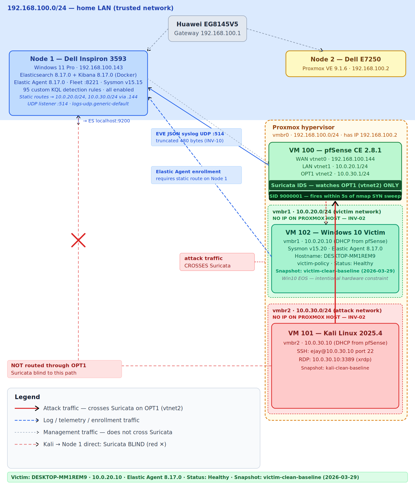

# SOC Homelab – Detection & Incident Response

**Focus:** SOC Analyst | Detection Engineering | Incident Response  

Hands-on SOC lab simulating real-world attacker behavior using **Sysmon (endpoint telemetry)** and **Suricata (network IDS)**, with investigation performed in **Elastic SIEM (Elasticsearch + Kibana)**.

---

## What this demonstrates

- Endpoint detection using Sysmon + KQL  
- Network detection using Suricata (custom rule engineering)  
- Correlation of network + endpoint telemetry  
- Incident response investigations mapped to MITRE ATT&CK  
- Detection gap analysis and remediation design  

---

## Example Detection (IR-001)



**Scenario:**  
- Tool transfer via `certutil.exe`  
- Persistence via scheduled task (`schtasks.exe`)  
- Encoded PowerShell execution  

**Evidence captured:**
- Sysmon Event ID 3 → outbound network connection  
- Sysmon Event ID 1 → scheduled task creation  
- Sysmon Event ID 11 → task file written  

**Full report:** `investigation-reports/IR-001.md`

---

## Key Achievements

- Built segmented lab where attack traffic must traverse a monitored interface (Suricata on OPT1)
- Identified limitation of ET SCAN rules in internal traffic scenarios and engineered a custom detection rule (SID 9000001)
- Created 95 Sysmon-based detection rules mapped to MITRE ATT&CK
- Verified real-time correlation between:
  - Network alerts (Suricata EVE JSON)
  - Endpoint telemetry (Sysmon via Elastic Agent)
- Performed full incident investigation with timeline reconstruction and detection gap analysis

---

## Architecture (Overview)

- Node 1: SOC Core (Elastic SIEM + Sysmon)
- Node 2: Proxmox lab (pfSense, Kali attacker, Windows victim)
- pfSense: Routing + Suricata IDS
- Network segmentation:
  - 10.0.30.0/24 → Attack network
  - 10.0.20.0/24 → Victim network
- Monitored traffic must traverse pfSense OPT1 (Suricata interface)

---

## Architecture Diagram



*Figure: Segmented lab with Suricata positioned on OPT1 to monitor attack traffic between networks*

---

## Architecture (Detailed)

```
192.168.100.0/24 — HOME LAN
│
├── Node 1: SOC Core (192.168.100.143)
│   └── Elasticsearch + Kibana + Fleet + Sysmon
│
└── Node 2: Proxmox (192.168.100.2)
    │
    ├── VM 100: pfSense (Router + IDS)
    │   ├── WAN  → 192.168.100.144 (vmbr0)
    │   ├── LAN  → 10.0.20.1/24   (vmbr1 - Victim Network)
    │   └── OPT1 → 10.0.30.1/24   (vmbr2 - Attack Network)
    │        └── Suricata (monitoring OPT1 / vtnet2)
    │
    ├── VM 101: Kali Linux
    │   └── 10.0.30.10 (Attack Network - vmbr2)
    │
    └── VM 102: Windows 10 Victim
        └── 10.0.20.10 (Victim Network - vmbr1)
```

**Monitored Traffic Path (Suricata visible):**

```
Kali (10.0.30.10)
   → pfSense OPT1 (Suricata)
   → pfSense LAN
   → Victim (10.0.20.10)
```

**Unmonitored Path (Suricata blind spot):**

```
Kali → Node 1 (192.168.100.143)
```

---

## Detection Pipelines

### Endpoint Pipeline

```
Victim (10.0.20.10)
  → Sysmon
  → Elastic Agent
  → Fleet Server (Node 1)
  → Elasticsearch
  → Kibana
```

### Network Pipeline

```
Kali (10.0.30.10)
  → pfSense OPT1 (Suricata)
  → EVE JSON (syslog)
  → Elastic Agent (Node 1)
  → Elasticsearch
  → Kibana
```

---

## Detection Engineering

### Custom Suricata Rule (SID 9000001)

```
alert tcp 10.0.30.0/24 any -> 10.0.20.0/24 any (
  msg:"LOCAL SCAN Kali SYN Sweep to Victim";
  flow:stateless; flags:S;
  threshold:type both, track by_src, count 15, seconds 5;
  sid:9000001; rev:1;
)
```

---

### Sysmon Detection Rules

- 95 custom KQL-based detection rules
- Coverage across MITRE ATT&CK tactics

Export:
detection-rules/sysmon-custom-rules.ndjson

---

## Investigation Reports

- IR-001: Tool Transfer & Persistence — COMPLETE  
- IR-002: Credential Access (LSASS) — IN PROGRESS  
- IR-003: Persistence — IN PROGRESS  
- IR-004: LOLBins — IN PROGRESS  
- IR-005: Full Kill Chain — PLANNED  

---

## Stack

- Elasticsearch / Kibana  
- Elastic Agent  
- Sysmon  
- Suricata  
- pfSense  
- Proxmox  
- Kali Linux  

---

## Hardware

| Node | Device | CPU | RAM | Role |
|------|--------|-----|-----|------|
| Node 1 | Dell Inspiron 3593 | i5-1035G1 | 16GB | SOC Core |
| Node 2 | Dell E7250 | i5-5300U | 8GB | Proxmox Lab |

---

## Repository Structure

```
soc-homelab/
├── README.md
├── docker/
├── detection-rules/
├── config/
├── scripts/
└── investigation-reports/
    ├── IR-001.md
    ├── IR-002.md
    ├── IR-003.md
    ├── IR-004.md
    ├── IR-005.md
    └── screenshots/
```

---

## Author

Farrukh Ejaz  
GitHub: https://github.com/farrukhCTI  
LinkedIn: https://linkedin.com/in/farrukhejazminhas  
