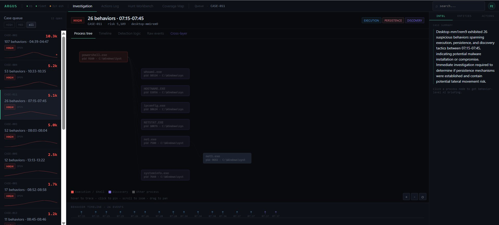
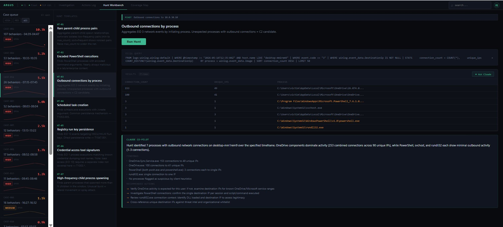

# Argus: SOC Investigation Console

Argus is a behavior-driven SOC investigation console built on top of Elasticsearch. It sits over two live telemetry pipelines: Sysmon (EDR) and Suricata (NDR), and converts raw endpoint events into structured, MITRE-mapped cases that an analyst can investigate without ever touching Kibana.

It runs on the same two-node homelab documented in the main README. No cloud. No SaaS. Two old Dell boxes.

---

## Why I built it

Kibana is great for querying data. It is not built for investigation workflow. When you have 107 suspicious behaviors across an 8-minute window, you need something that tells you which ones matter, what the process chain looks like, and what to do next. That is what Argus does.

---

## How it works

Three Python daemons run continuously in the background:

**behavior_detector.py** polls the EDR index every 60 seconds. It runs 44 detection profiles against raw Sysmon EID 1, 10, 11, and 13 events. Each profile matches on process image, command-line context, and event ID, then scores the hit by tactic weight and confidence tier. Results are written to the `argus-behaviors` index with deterministic IDs so the pipeline is fully idempotent across repeated runs.

**case_builder.py** groups behaviors into cases using a 10-minute sliding window. It requires a minimum of 3 behaviors, at least 1 distinct tactic, and a density check (3+ events within any 2-minute sub-window) before it creates a case. This prevents noise from generating false cases.

**app.py** is a FastAPI backend serving 15 API routes. The React frontend proxies all requests through Vite to this backend.

---

## Screens

### Case Queue



The left rail is the case queue. Every case shows the case ID, behavior count, time window, severity badge, risk score, and tactic tags showing the tactics observed in that case.

Cases are sorted by risk score descending. The HIGH/MED/all filter chips at the top narrow the list instantly. At a glance an analyst can see which cases are worth opening and which can wait.

The center workspace defaults to "select a case from the queue" until a case is selected. The right rail shows Intel/Entities/Actions tabs that stay visible throughout the investigation.

---

### Case Selected: AI Case Summary


Clicking a case loads the investigation workspace. The case header shows severity, behavior count, time window, host, risk score, and the tactics involved (EXECUTION, DISCOVERY, PERSISTENCE as chips).

The right rail Intel tab immediately shows a Claude Haiku-generated case summary. This is cached in Elasticsearch on first generation and served instantly on subsequent loads. The summary is narration only: it describes what happened, it does not make decisions.

The process tree loads in the center workspace automatically.

---

### Process Tree: Full Chain


The process tree is built from raw Sysmon EID 1 events using a 30-minute window around the case. It reconstructs the full parent-child process chain from the richest attack subtree in the data.

Node colors indicate tactic tier: red nodes are execution and shell processes (PowerShell, cmd, schtasks, wscript), teal nodes are discovery tools (whoami, ipconfig, net, systeminfo), grey nodes are benign system processes observed in telemetry but not matched by any detection profile. A legend below the canvas identifies each tier.

The behavior timeline strip at the bottom shows events plotted chronologically with tactic color coding.

---

### Process Tree: Node Click and AI Briefing


Clicking any node pins the investigation to that specific behavior. The system matches the node's PID against the behavior documents for that case and loads the Claude Haiku briefing for the matched behavior.

The right rail shows an escalation recommendation, a behavioral analysis identifying the relevant MITRE technique, and numbered next steps the analyst should take. Path tracing is active: everything outside the ancestry chain of the clicked node is dimmed to 30% opacity.

This is the core investigation loop: tree → click → briefing → next steps.

Nodes that appear in raw Sysmon telemetry but have no matching detection profile render as grey "Other process" nodes. They are visible in the tree for process chain context but contribute no risk score. This suppression logic is intentional: net1.exe spawned internally by net.exe is a common example.

---

### Behavior Timeline


The Timeline tab shows all behaviors for this case in chronological order. Each row shows the UTC timestamp, tactic label, and behavior description. Useful for understanding attack sequencing and distinguishing automated script execution (rapid burst) from manual operator activity (irregular spacing).

---

### Cross-layer Correlation


The Cross-layer tab queries the NDR pipeline (Suricata via Filebeat) for network events matching the victim IP within a 15-minute window around the selected behavior. It returns flow records, alert signatures, destination IPs, and HTTP metadata from an entirely separate sensor with no shared data path to the EDR pipeline.

When corroboration is found, the tab renders an attack progression panel (EDR behavior on the left, NDR network activity on the right), an analyst assessment section (finding, implication, confidence), and a network evidence table showing individual Suricata events with User-Agent strings, URIs, and timestamps.

Entity pivot links on remote IPs, process names, and URIs navigate directly to the Hunt Workbench with the relevant template pre-filled. The pivot source is displayed as a banner in the workbench so the analyst retains context across screens.

In the IR-006 investigation, this tab confirmed 6 Suricata http and fileinfo events independently corroborating 3 repeated PowerShell HTTP retrievals observed in EDR. Both pipelines recorded the same source IP, destination IP, port, and URI with no shared data path.

---

### Hunt Workbench


The Hunt Workbench gives the analyst 7 ES|QL-based hunt templates covering the most common detection scenarios:

| Template | Description |
|---|---|
| HT-01 | Rare parent-child process pairs |
| HT-02 | Encoded PowerShell executions |
| HT-03 | Outbound connections by process |
| HT-04 | Scheduled task creation |
| HT-05 | Registry run key persistence |
| HT-06 | Credential access tool signatures |
| HT-07 | High-frequency child process spawning |

Selecting a template shows the description, parameters, and a Run Hunt button. The ES|QL query executes against the live EDR index and results render in a table. Suspicious rows are highlighted in amber.

---

### Hunt Workbench: Entity Pivot



When navigating from the Cross-layer tab via an entity pivot, the Hunt Workbench pre-fills the relevant template and parameters automatically. A banner at the top of the results panel identifies the pivot source (entity value and originating case ID) so the analyst knows what triggered the hunt.

In this screenshot, a pivot on remote IP 10.0.30.10 from the Cross-layer tab pre-filled HT-03 (Outbound connections by process). Results confirmed `C:\Windows\System32\WindowsPowerShell\v1.0\powershell.exe` as the process responsible for 3 outbound connections to a single IP, matching the NDR-observed HTTP flows.

---

### Hunt Workbench: Claude Co-pilot


After a hunt run, clicking Ask Claude sends the results to Claude Haiku for interpretation. The co-pilot returns a structured analysis: summary of what the hunt found, findings per notable result, recommended actions, and MITRE ATT&CK references.

This is not a decision engine. It summarizes what the data shows. Triage decisions remain with the analyst.

---

### Coverage Map

The Coverage Map screen shows which of the 44 detection profiles cover which MITRE ATT&CK techniques and sub-techniques. Three layers are displayed: Elastic Agent native detections, Argus custom profiles, and cross-layer corroboration capability. Each technique card shows a confidence dot and whether it is covered by EDR, NDR, or both pipelines.

---

### Analyst Actions and Closure States

The right rail Actions tab lets the analyst log decisions against individual behaviors: ESCALATE, BLOCK IP, ADD NOTE. All actions are written back to Elasticsearch with timestamps and actor attribution.

Case closure is handled via three states in the Actions tab: RESOLVED, CONFIRMED MALICIOUS, and FALSE POSITIVE. Closure state badges appear in the Actions Log global view alongside the full analyst decision audit trail.

---

## Architecture

```
Windows 10 Victim (10.0.20.10)          pfSense OPT1
  Sysmon EID 1/3/10/11/13                 Suricata IDS
    -> Elastic Agent                         EVE JSON
    -> Fleet Server                       -> Filebeat 7.14.0 (standalone)
    -> Elasticsearch                      -> Elasticsearch
    logs-winlog.winlog-default               filebeat-*
              |                                    |
              +------------- behavior_detector.py -+
                             44 detection profiles
                             multi-EID matching
                             60s poll, idempotent writes
                                    |
                             argus-behaviors index
                                    |
                             case_builder.py (60s poll)
                             10min window, density check
                             multi-tactic requirement
                                    |
                             argus-cases index
                                    |
                             FastAPI (app.py)
                             15 API routes
                             /api/behaviors/{id}/network_context
                             queries filebeat-* for cross-layer
                                    |
                             React + Vite (localhost:5173)
                             4-screen workstation layout:
                             Investigation | Actions Log
                             Hunt Workbench | Coverage Map
```

---

## API routes

| Route | Method | Description |
|---|---|---|
| /api/cases | GET | List all cases, sorted by risk score |
| /api/cases/{id}/behaviors | GET | Behaviors for a case |
| /api/cases/{id}/summary | GET | AI case summary (cached) |
| /api/behaviors/{id} | GET | Single behavior document |
| /api/behaviors/{id}/process_tree | GET | Process tree from raw Sysmon EID 1 |
| /api/behaviors/{id}/network_context | GET | Cross-layer: Suricata events ±15min |
| /api/actions | GET | Global actions log |
| /api/actions | POST | Write analyst action to ES |
| /api/hunt/templates | GET | List hunt templates |
| /api/hunt | POST | Execute ES|QL hunt template |
| /api/hunt/raw_esql | POST | Execute raw ES|QL query |
| /api/hunt/create_behavior | POST | Manually create behavior document |
| /api/brief | POST | Generate behavior briefing via Claude |
| /api/brief/{behavior_id} | GET | Fetch cached briefing |
| /api/hunt/copilot | POST | Hunt co-pilot via Claude |

---

## Claude API boundary

Claude Haiku is used at three points only:

1. Case summary: short description of what the case represents, cached in the argus-cases index
2. Behavior briefing: per-node analysis with next steps, cached in argus-briefings index
3. Hunt co-pilot: interpretation of hunt results on demand

Detection, scoring, and case formation are fully deterministic. Claude never contributes to risk scores or triage decisions.

---

## Validated against live telemetry

IR-006 documents a complete investigation conducted inside Argus against CASE-011, a live case formed from a controlled five-stage attack scenario executed on 2026-05-16. The investigation covered:

- Case triage (26 behaviors, risk 5,109, HIGH severity)
- Process tree analysis (powershell.exe root, full discovery chain)
- Cross-layer corroboration (6 Suricata events independently confirming EDR-observed PowerShell HTTP activity across separate sensors with no shared data path)
- Entity pivot to hunt workbench (10.0.30.10 → HT-03 → powershell.exe confirmed as outbound initiator)
- Analyst action logging (ESCALATE recorded at 12:37:09 UTC)

See `investigation-reports/IR-006/` for the full report and screenshots.

---

## Stack

| Component | Version | Role |
|---|---|---|
| Elasticsearch | 8.17.0 | Data storage |
| FastAPI | Latest | API backend |
| React + TypeScript | 18 | Frontend |
| Vite | 8 | Dev server and proxy |
| TanStack Query | v5 | Data fetching |
| D3.js | Latest | Process tree rendering |
| Claude Haiku | claude-haiku-4-5 | Narration layer |
| Python | 3.14 | Detection daemons |
