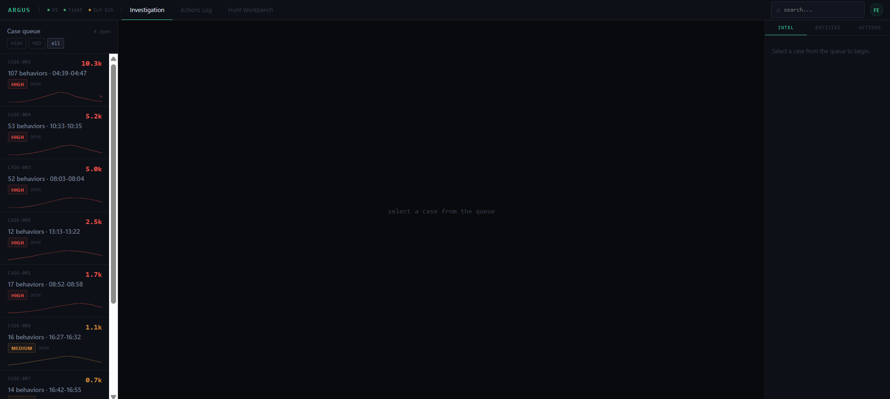
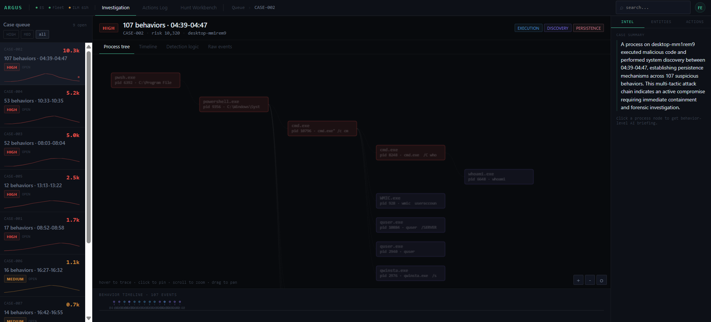
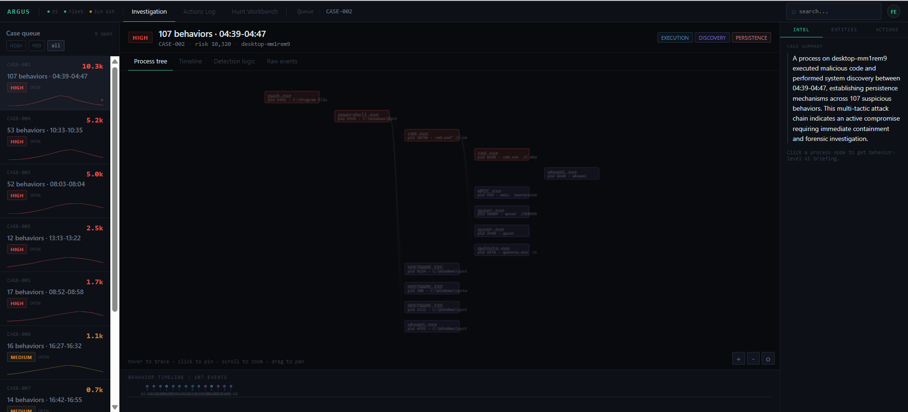
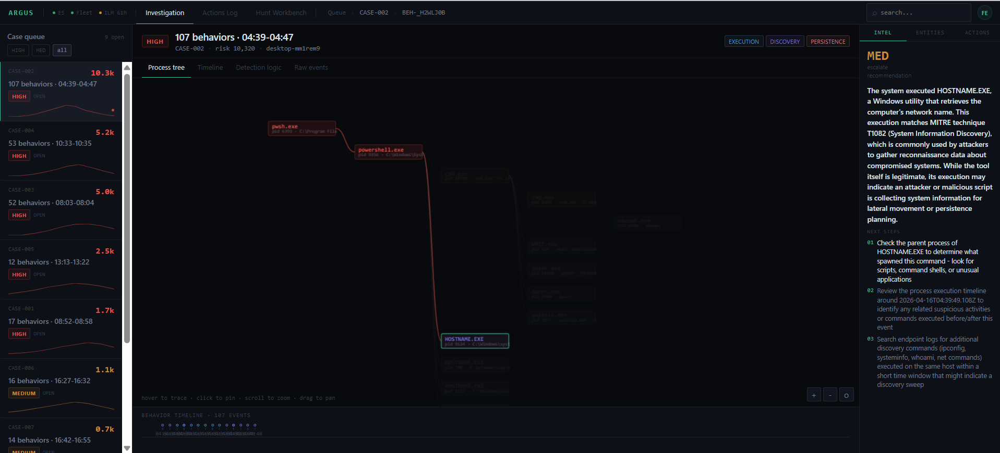
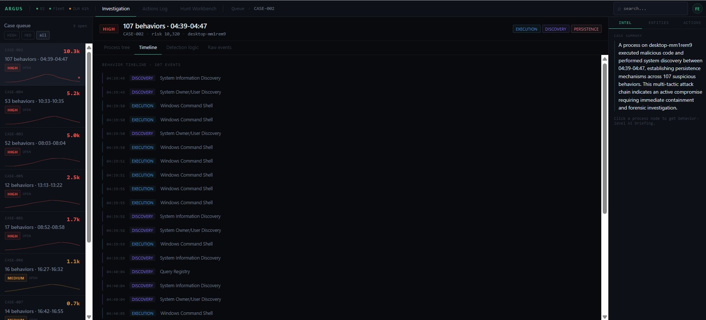
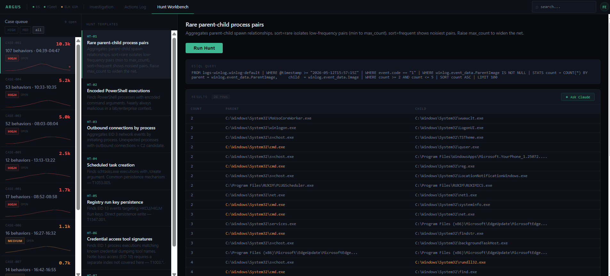
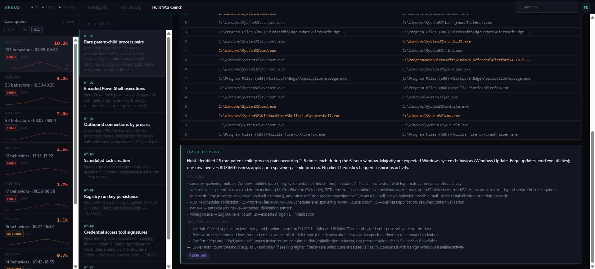

# Argus: SOC Investigation Console

Argus is a behavior-driven SOC investigation console built on top of Elasticsearch. It sits over two live telemetry pipelines: Sysmon (EDR) and Suricata (NDR): and converts raw endpoint events into structured, MITRE-mapped cases that an analyst can investigate without ever touching Kibana.

It runs on the same two-node homelab documented in the main README. No cloud. No SaaS. Two old Dell boxes.

---

## Why I built it

Kibana is great for querying data. It is not built for investigation workflow. When you have 107 suspicious behaviors across an 8-minute window, you need something that tells you which ones matter, what the process chain looks like, and what to do next. That is what Argus does.

---

## How it works

Three Python daemons run continuously in the background:

**behavior_detector.py** polls the EDR index every 60 seconds. It runs 96 custom MITRE-mapped detection rules against raw Sysmon EID 1 events, scores each hit by tactic weight, and writes structured behavior documents to a dedicated `argus-behaviors` index. Each document gets a deterministic ID so the pipeline is fully idempotent across repeated runs.

**case_builder.py** groups behaviors into cases using a 10-minute sliding window. It requires a minimum of 5 behaviors, at least 2 distinct tactics, and a density check (3+ events within any 2-minute sub-window) before it creates a case. This prevents noise from generating false cases.

**app.py** is a FastAPI backend serving 16 API routes. The React frontend proxies all requests through Vite to this backend.

---

## Screens

### Case Queue



The left rail is the case queue. Every case shows the case ID, behavior count, time window, severity badge, risk score, and a sparkline of behavior volume over time. The red dot on the top case is a live pulse indicator showing the most recently active case.

Cases are sorted by risk score descending. The HIGH/MED/all filter chips at the top narrow the list instantly. At a glance an analyst can see which cases are worth opening and which can wait.

The center workspace defaults to "select a case from the queue" until a case is selected. The right rail shows Intel/Entities/Actions tabs that stay visible throughout the investigation.

---

### Case Selected: AI Case Summary



Clicking a case loads the investigation workspace. The case header shows severity, behavior count, time window, host, risk score, and the tactics involved (EXECUTION, DISCOVERY, PERSISTENCE as chips).

The right rail Intel tab immediately shows a Claude Haiku-generated case summary. This is cached in Elasticsearch on first generation and served instantly on subsequent loads. The summary is narration only: it describes what happened, it does not make decisions.

The process tree loads in the center workspace automatically.

---

### Process Tree: Full Chain



The process tree is built from raw Sysmon EID 1 events using a 30-minute window around the case. It reconstructs the full parent-child process chain from the richest attack subtree in the data.

The tree uses a canvas renderer with zoom, pan, hover path tracing, and click-to-investigate. Node colors indicate tier: red nodes are high-risk processes (PowerShell, cmd, schtasks, wscript), purple nodes are discovery tools (whoami, ipconfig, net, systeminfo), grey nodes are benign system processes.

This screenshot shows pwsh.exe spawning powershell.exe, which spawns cmd.exe, which fans out into a cluster of discovery commands. The full attack chain is visible in one view.

The behavior timeline strip at the bottom shows 107 events plotted chronologically with tactic color coding.

---

### Process Tree: Node Click and AI Briefing



Clicking any node pins the investigation to that specific behavior. The system matches the node's PID against the behavior documents for that case and loads the Claude Haiku briefing for the matched behavior.

In this screenshot, HOSTNAME.EXE was clicked. The right rail shows:

- **MED** escalation recommendation
- A 3-sentence behavioral analysis identifying T1082 (System Information Discovery)
- Three numbered next steps the analyst should take

The path tracing is active: everything except the ancestry chain of the clicked node is dimmed to 30% opacity. The analyst can see exactly which process led to this execution.

This is the core investigation loop: tree → click → briefing → next steps.

---

### Behavior Timeline



The Timeline tab shows all 107 behaviors for this case in chronological order. Each row shows the UTC timestamp, tactic label (DISCOVERY in blue, EXECUTION in orange), and behavior description.

This view is useful for understanding sequencing. You can see the attack pattern: Discovery and Execution techniques interleaved rapidly between 04:39 and 04:40, which is consistent with an automated script running enumeration commands in sequence rather than manual operator activity.

---

### Hunt Workbench



The Hunt Workbench gives the analyst 7 ES|QL-based hunt templates. The sidebar lists all templates. Selecting one shows the description, parameters, and a Run Hunt button.

This screenshot shows HT-01 (Rare parent-child process pairs) after a run. The ES|QL query is shown in full above the results table. Results show count, parent process path, and child process path. Suspicious pairs (cmd.exe spawning quser.exe, powershell.exe spawning cmd.exe) are highlighted in amber.

The Ask Claude button at the top right of the results panel sends the results to the co-pilot.

---

### Hunt Workbench: Claude Co-pilot



After a hunt run, clicking Ask Claude sends the results to Claude Haiku for interpretation. The co-pilot returns a structured analysis: summary of what the hunt found, bullet-point findings for each notable result, recommended actions, and MITRE ATT&CK tags.

In this screenshot the co-pilot correctly identifies that cmd.exe spawning quser.exe and powershell.exe spawning cmd.exe are consistent with scripted activity or legitimate admin behavior, flags the RUXIM business application as requiring context validation, and recommends lowering the max_count threshold to surface higher-fidelity rare pairs.

This is not a decision engine. It is a narration layer that saves the analyst time by summarizing what the data shows, not by telling them what to conclude.

---

## Architecture

```
Windows 10 Victim (10.0.20.10)
  Sysmon EID 1 events
    -> Elastic Agent -> Fleet Server -> Elasticsearch
                                            |
                                    behavior_detector.py (60s poll)
                                    96 MITRE-mapped detection rules
                                            |
                                    argus-behaviors index
                                            |
                                    case_builder.py (60s poll)
                                    10min window, density check
                                            |
                                    argus-cases index
                                            |
                                    FastAPI (app.py)
                                    16 API routes
                                            |
                                    React + Vite (localhost:5173)
                                    3-column workstation layout
```

---

## Claude API boundary

Claude Haiku is used at three points only:

1. Case summary: 1-2 sentence description of what the case represents, cached in ES
2. Behavior briefing: per-node analysis with next steps, cached in argus-briefings index
3. Hunt co-pilot: interpretation of hunt results on demand

It is narration only. Risk scoring, behavior detection, and case building are all deterministic. Claude never makes a triage decision.

---

## What is coming next

- Cross-layer correlation tab: Sysmon and Suricata events side by side for the same host and time window. The 23=23 proof already exists (23 Sysmon EID 3 beacon events independently corroborated by 23 Suricata HTTP flow records). Surface it in the UI.
- Coverage map: MITRE ATT&CK grid showing which of the 96 rules cover which techniques and sub-techniques.
- Controlled investigation: a full multi-stage attack scenario run through the lab, investigated live in Argus, written up as an IR report.

---

## Stack

| Component | Role |
|---|---|
| Elasticsearch 8.17.0 | Data storage |
| FastAPI | API backend |
| React 18 + TypeScript | Frontend |
| Vite | Dev server and proxy |
| TanStack Query v5 | Data fetching |
| HTML5 Canvas | Process tree rendering |
| Claude Haiku | Narration layer |
| Python 3.14 | Detection daemons |
