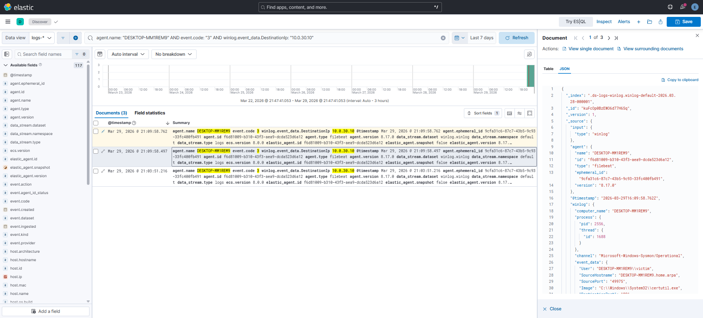
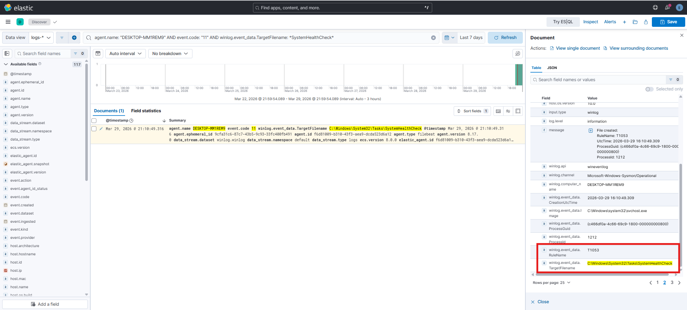

# IR-001: Post-Compromise Tool Transfer and Persistence (Chained Simulation)

**Classification:** Controlled Simulation
**Analyst:** Farrukh Ejaz
**Date:** 2026-03-29
**Status:** Closed
**Severity:** High
**Host:** DESKTOP-MM1REM9 (10.0.20.10) — Windows 10 Pro 22H2
**MITRE ATT&CK:** T1105, T1053.005, T1059.001 (attempted), T1218.003

---

## 1. Executive Summary

On 2026-03-29, suspicious post-compromise activity was observed on a Windows 10 endpoint (DESKTOP-MM1REM9). The activity involved the use of a legitimate Windows utility (`certutil.exe`) to download a file from an internal host (10.0.30.10), followed by the creation of a scheduled task designed to execute an encoded PowerShell command under the SYSTEM account.

This report analyzes a chained attacker workflow combining tool transfer and persistence within a short time window to simulate real-world operator behavior after initial access has already been obtained.

Windows Defender initially blocked the file download attempt, indicating that preventive controls were functioning. However, the control was bypassed, allowing the attacker to proceed with persistence.

**Current status:** Activity contained within a controlled environment. No lateral movement or data exfiltration observed. Artifacts remain on disk for analysis.

**Worst case if real:** The scheduled task ensures persistent SYSTEM-level execution on logon, allowing the attacker to maintain long-term access and re-establish command execution after reboot. This level of persistence is consistent with pre-ransomware dwell phases.

---

## 2. Technical Detail

**Audience:** IR team and detection engineers

---

### Methodology

**Collection:**
Sysmon (Event IDs 1, 3, 11) via Elastic Agent was used for endpoint telemetry. Logs were analyzed in Kibana Discover using field-based queries (`winlog.event_data.*`). No dashboards were used.

**Analysis:**
Events were correlated chronologically using `agent.name: "DESKTOP-MM1REM9"`. Four key events were identified within a 52-second window and linked through process behavior and timing.

**Enrichment:**

* `certutil.exe` → T1105, T1218.003
* `schtasks.exe` → T1053.005
* Encoded PowerShell → T1059.001 (execution not observed)

**Conclusion:**
The endpoint downloaded a file from an attacker-controlled host and established persistence via a scheduled task executing an encoded PowerShell command. The activity is consistent with post-compromise staging behavior.

---

### Baseline and Tripwires

**Network baseline:**
Suricata is deployed on OPT1 and successfully sees traffic crossing between networks. However, detection is limited to SYN scan behavior (SID 9000001). The HTTP download was visible to Suricata but did not trigger any alert due to lack of matching rules.

**Endpoint baseline:**
Sysmon with SwiftOnSecurity configuration is active. The scheduled task creation was automatically tagged with `RuleName: T1053`, confirming detection capability at the endpoint level.

**Investigation type:**
Reactive triage based on observed activity.

---

### Breach Chain

**Initial access:**
Out of scope. Assumed via existing user session.

**First observed activity:**
2026-03-29T16:09:57.441Z

**Tool transfer:**
`certutil.exe` initiated outbound connections to 10.0.30.10:80 and downloaded a file to disk.

**Persistence:**
`schtasks.exe` created a scheduled task ("SystemHealthCheck") configured to execute encoded PowerShell as SYSTEM at logon.

**Privilege context:**
Command executed with elevated integrity. Scheduled task configured to run as SYSTEM.

**Data exfiltration:**
None observed.

**System impact:**
File written to disk and scheduled task created. Limited integrity impact, but persistence established.

**Threat context:**
The observed behavior is consistent with TTPs documented in multiple threat groups that leverage living-off-the-land binaries for staging and persistence. This is pattern matching, not attribution.

---

### Timeline (UTC)

| Timestamp                | Event ID | Key Fields                                                                       | MITRE     |
| ------------------------ | -------- | -------------------------------------------------------------------------------- | --------- |
| 2026-03-29T16:09:57.441Z | 3        | Image: certutil.exe, SourceIp: 10.0.20.10, DestinationIp: 10.0.30.10, Port: 80   | T1105     |
| 2026-03-29T16:09:57.506Z | 3        | Image: certutil.exe, SourceIp: 10.0.20.10, DestinationIp: 10.0.30.10, Port: 80   | T1105     |
| 2026-03-29T16:10:49.257Z | 1        | Image: schtasks.exe, Parent: cmd.exe, CommandLine: schtasks /create ... -enc ... | T1053.005 |
| 2026-03-29T16:10:49.309Z | 11       | TargetFilename: C:\Windows\System32\Tasks\SystemHealthCheck, User: SYSTEM        | T1053.005 |

---

### Notable Observations

* `certutil.exe` generated two TCP connections within milliseconds, consistent with its known dual-request behavior.
* The scheduled task contains an encoded PowerShell command, indicating intent to obfuscate execution.
* The binary (`schtasks.exe`) is legitimate; malicious behavior is driven by arguments.
* A 52-second delay between stages reflects operator interaction time.

---

### Screenshots

* 
* 
* 

---

## 3. Gaps and Remediation

### Detection Gaps

**Gap 1: No alert for HTTP tool transfer**
Traffic crossed Suricata but did not match any detection rule.

**Fix:**
Add rule:
alert http 10.0.20.0/24 any -> 10.0.30.0/24 80 (msg:"LOCAL HTTP outbound victim to attack network"; sid:9000002; rev:1;)

---

**Gap 2: Defender disablement not detected**
Defender blocked execution but was bypassed without alerting.

**Fix:**
Monitor Defender tampering:
agent.name: "DESKTOP-MM1REM9" AND event.code: "13" AND winlog.event_data.TargetObject: *Windows Defender*

---

**Gap 3: Missing certutil process creation event**
Event ID 1 not captured. Execution confirmed via Event ID 3.

**Fix:**
Review Sysmon config for ProcessCreate coverage.

---

### Remediation

* Re-enable Defender real-time protection
* Remove scheduled task
* Delete dropped file
* Revert VM snapshot if required

---

### Mitigation

* Restrict LOLBin network usage (ASR rules)
* Limit scheduled task creation via policy
* Enforce outbound traffic controls
* Alert on encoded PowerShell usage
* Monitor Defender disable events in real time