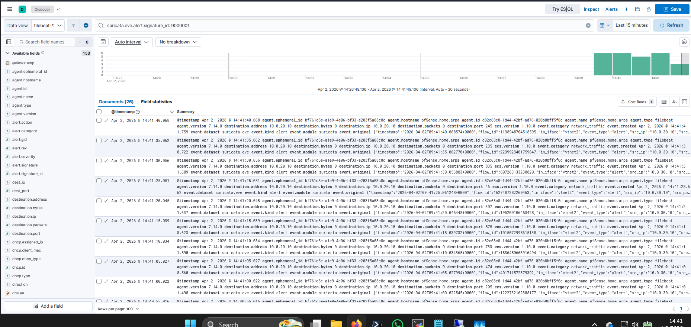
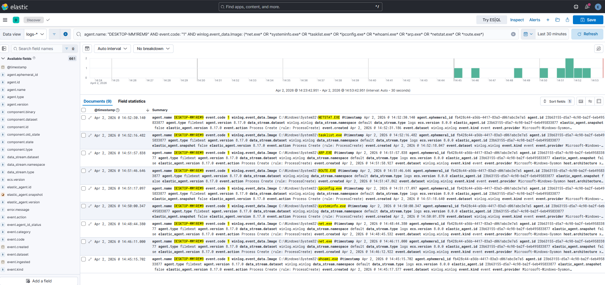

# IR-002: Reconnaissance and Host Discovery

**Classification:** Controlled Simulation
**Analyst:** Farrukh Ejaz
**Date:** 2026-04-02
**Status:** Closed
**Severity:** Medium
**Host:** DESKTOP-MM1REM9 (10.0.20.10), Windows 10 Pro 22H2
**MITRE ATT&CK:** T1046, T1082, T1033, T1016
**Connected Narrative:** This report begins the IR-002 through IR-005 kill chain. It establishes T=0 for the full attack timeline and documents the initial external and internal reconnaissance phase that precedes execution and persistence activity documented in IR-003 and IR-004.

---

## 1. Executive Summary

On 2026-04-02, network scanning activity originating from an internal attack host (10.0.30.10) was detected against a Windows 10 endpoint (DESKTOP-MM1REM9, 10.0.20.10). The scan triggered a custom Suricata detection rule (SID 9000001) within seconds of initiation, providing the earliest timestamp anchor for this investigation.

Following the external scan, a burst of native Windows reconnaissance binaries was executed on the victim host across a seven-minute window. Commands included `whoami`, `net user`, `systeminfo`, `ipconfig`, `route print`, `arp`, `tasklist`, and `netstat`, all executed from a single elevated PowerShell session, consistent with deliberate manual enumeration after initial access.

No lateral movement or data exfiltration was observed. This activity represents the reconnaissance phase of a broader attack sequence that continues in IR-003.

**Worst case if real:** An attacker with this level of host and network visibility has sufficient information to identify high-value targets, plan lateral movement, and establish persistence. This phase typically precedes credential access and C2 establishment in pre-ransomware intrusions.

---

## 2. Technical Detail

**Audience:** IR team and detection engineers

---

### Methodology

**Collection:**
NDR telemetry collected via Suricata on pfSense OPT1 interface, shipped to Elasticsearch via Filebeat (filebeat-* index). EDR telemetry collected via Sysmon v15.20 and Elastic Agent 8.17.0 on the victim host (logs-winlog.winlog-default index). Analysis performed in Kibana Discover using field-based KQL queries against `winlog.event_data.*` fields.

**Analysis:**
NDR alert timestamp used as T=0. EDR events correlated forward from T=0 using `agent.name: "DESKTOP-MM1REM9"`. Recon binary burst identified within a seven-minute window starting at 14:45. All nine recon commands traced to a single parent PowerShell session via shared ParentProcessGuid.

**Enrichment:**
- `whoami`, `net user`, `net localgroup` -> T1033 (System Owner/User Discovery)
- `systeminfo` -> T1082 (System Information Discovery)
- `ipconfig`, `route print`, `arp` -> T1016 (System Network Configuration Discovery)
- `tasklist`, `netstat` -> T1057, T1049
- Nmap SYN/connect scan -> T1046 (Network Service Discovery)

**Conclusion:**
Two-stage reconnaissance confirmed. External network scan detected at NDR layer. Internal host enumeration detected at EDR layer. Both stages traceable to the same operator session.

---

### Baseline and Tripwires

**Network baseline:**
Suricata deployed on pfSense OPT1 monitors traffic between the attack network (10.0.30.0/24) and victim network (10.0.20.0/24). Standard ET SCAN rules do not fire on internal traffic. SID 9000001 is a custom rule written specifically for this environment. It fired within 5 seconds of scan initiation.

**Endpoint baseline:**
Sysmon with SwiftOnSecurity configuration active on victim. All nine recon binaries are native Windows executables, none are blocked by Defender. Detection relies entirely on process creation telemetry and behavioral density analysis.

**Investigation type:**
Proactive detection via NDR alert, correlated with EDR telemetry.

---

### Breach Chain

**Initial access:**
Out of scope. Assumed via existing elevated session (IntegrityLevel: High confirmed on all recon processes).

**First observed activity:**
2026-04-02T14:41:40 — Suricata SID 9000001 fires on Nmap SYN scan from 10.0.30.10 targeting 10.0.20.10 ports 1-1000.

**External reconnaissance:**
Two Nmap scans executed from Kali (10.0.30.10): SYN scan (-sS, ports 1-1000) and connect scan (-sT, ports 22/80/443/445/3389). NDR generated 26 alert records across both scans.

**Internal reconnaissance:**
Nine native recon commands executed on victim from a single elevated PowerShell session (ParentProcessGuid: {c466df0a-c199-69cc-5006-000000000a00}) between 14:45 and 14:52. Commands spaced 30-60 seconds apart, consistent with deliberate manual enumeration rather than scripted batch execution.

**Privilege context:**
All processes executed at High integrity level under `DESKTOP-MM1REM9\victim`. No privilege escalation observed.

**Data exfiltration:**
None observed.

---

### Timeline (UTC)

| Timestamp | Event ID | Source | Key Fields | MITRE |
|---|---|---|---|---|
| 2026-04-02T14:41:40 | Alert | Suricata (NDR) | SID 9000001, src: 10.0.30.10, dest: 10.0.20.10 | T1046 |
| 2026-04-02T14:45:15 | 1 | Sysmon (EDR) | Image: whoami.exe, CommandLine: whoami /all, IntegrityLevel: High | T1033 |
| 2026-04-02T14:46:11 | 1 | Sysmon (EDR) | Image: net.exe, CommandLine: net user | T1033 |
| 2026-04-02T14:48:44 | 1 | Sysmon (EDR) | Image: net.exe, CommandLine: net localgroup administrators | T1033 |
| 2026-04-02T14:50:00 | 1 | Sysmon (EDR) | Image: systeminfo.exe, CommandLine: systeminfo \| findstr ... | T1082 |
| 2026-04-02T14:51:17 | 1 | Sysmon (EDR) | Image: ipconfig.exe, CommandLine: ipconfig /all | T1016 |
| 2026-04-02T14:51:46 | 1 | Sysmon (EDR) | Image: route.exe, CommandLine: route print | T1016 |
| 2026-04-02T14:51:57 | 1 | Sysmon (EDR) | Image: arp.exe, CommandLine: arp -a | T1016 |
| 2026-04-02T14:52:16 | 1 | Sysmon (EDR) | Image: tasklist.exe, CommandLine: tasklist /v | T1057 |
| 2026-04-02T14:52:30 | 1 | Sysmon (EDR) | Image: netstat.exe, CommandLine: netstat -ano | T1049 |

---

### Notable Observations

- All nine recon binaries share an identical ParentProcessGuid (`{c466df0a-c199-69cc-5006-000000000a00}`), confirming execution from a single operator-controlled PowerShell session. This GUID serves as the operator session anchor for IR-005 cross-IR correlation.
- Command spacing of 30-60 seconds between binaries is consistent with deliberate manual enumeration. Scripted batch execution would produce sub-second spacing. This behavioral pattern has implications for detection tuning, as density thresholds must account for human-paced execution.
- The external scan (NDR) and internal recon (EDR) are separated by approximately four minutes, consistent with an operator reviewing scan results before proceeding to host enumeration.
- Nmap connect scan (-sT) on ports 22/80/443/445/3389 reveals specific service interest: RDP (3389) and SMB (445) are typical lateral movement prerequisites.

---

### Screenshots

- 
- 

---

## 3. Gaps and Remediation

### Detection Gaps

**Gap 1: No alert on internal Nmap connect scan**
SID 9000001 fires on SYN scan behavior. The subsequent connect scan (-sT) on specific ports generated Suricata flow records but no dedicated alert. An analyst reviewing only alerts would miss the second scan pass.

**Fix:**
```
alert tcp 10.0.30.0/24 any -> 10.0.20.0/24 [22,80,443,445,3389] (msg:"LOCAL Targeted port scan victim network"; flags:S; threshold: type threshold, track by_src, count 3, seconds 10; sid:9000003; rev:1;)
```

**Gap 2: No behavioral alert on recon binary density**
Nine native recon binaries executed within seven minutes from a single parent session generates no alert by default. Individual binary executions are legitimate in isolation. The detection signal is density and sequence, not any single event.

**Fix:**
Detection rule targeting recon binary burst from same parent within short window:
```
agent.name: "DESKTOP-MM1REM9" AND event.code: "1" AND winlog.event_data.Image: (*whoami.exe* OR *net.exe* OR *systeminfo.exe* OR *ipconfig.exe* OR *arp.exe* OR *netstat.exe* OR *route.exe* OR *tasklist.exe*)
```
Threshold: 4+ hits within 5 minutes from same ParentProcessGuid = alert.

**Gap 3: No NDR visibility into internal host enumeration**
Suricata sees network traffic only. The internal recon commands (whoami, systeminfo, etc.) generate no network traffic and are invisible to NDR. Detection is EDR-dependent for this stage.

**Fix:**
No NDR fix possible for host-local enumeration. Ensure EDR coverage is maintained and Sysmon ProcessCreate rules cover all relevant binaries. Document as architectural limitation.

---

### Remediation

- No immediate remediation required in controlled environment
- Revert victim VM to clean snapshot before next IR phase if needed
- Ensure SID 9000001 remains active in Suricata ruleset

---

### Mitigation

- Implement recon binary density alerting as described in Gap 2
- Add targeted port scan rule as described in Gap 1
- Restrict `net.exe`, `whoami.exe`, `systeminfo.exe` execution via AppLocker or ASR rules in production environments
- Monitor for elevated PowerShell sessions spawning multiple enumeration binaries in short succession
- Enforce network segmentation to limit cross-network scanning visibility
