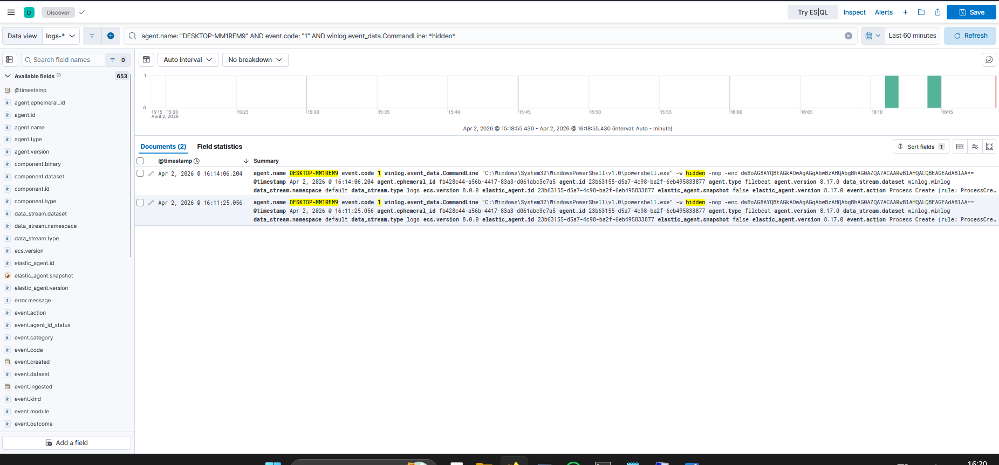
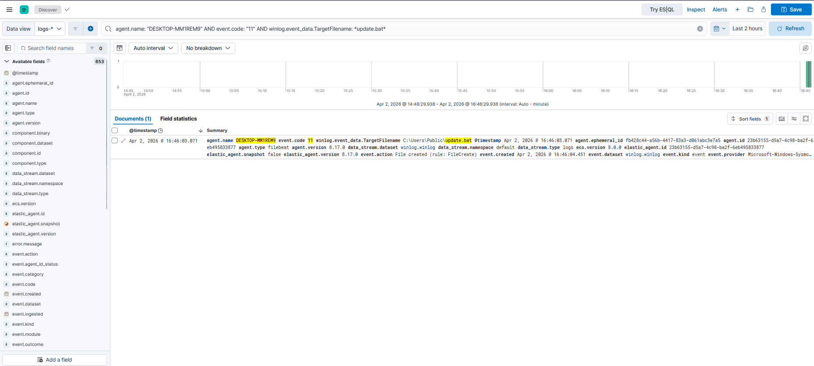
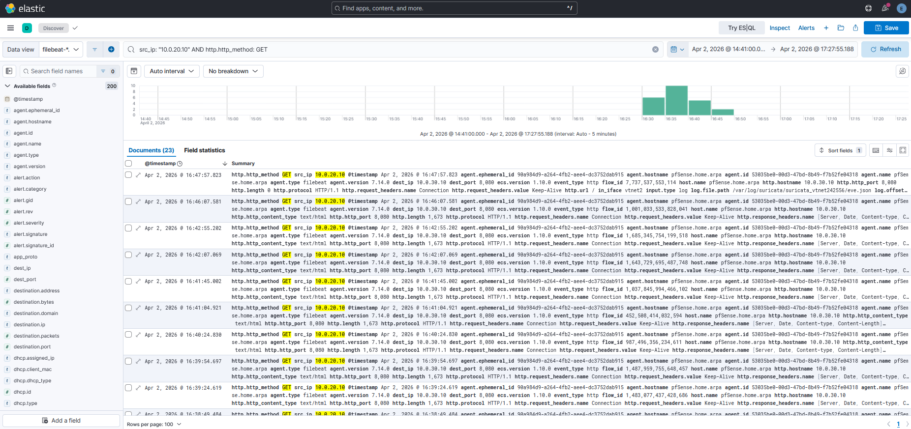
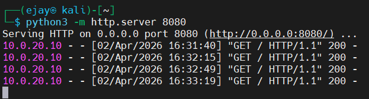

# IR-003: Encoded PowerShell Execution and C2 Beaconing

**Classification:** Controlled Simulation
**Analyst:** Farrukh Ejaz
**Date:** 2026-04-02
**Status:** Closed
**Severity:** High
**Host:** DESKTOP-MM1REM9 (10.0.20.10), Windows 10 Pro 22H2
**MITRE ATT&CK:** T1059.001, T1071.001, T1027, T1105
**Connected Narrative:** This report continues from IR-002 (Reconnaissance and Host Discovery). Following host enumeration, the threat actor transitioned to execution via encoded PowerShell and established jittered HTTP C2 communications to the attack host (10.0.30.10). A staged file (update.bat) was downloaded to disk. This activity is followed by defense evasion and persistence documented in IR-004.

---

## 1. Executive Summary

On 2026-04-02, encoded PowerShell execution was observed on DESKTOP-MM1REM9 approximately 79 minutes after the initial reconnaissance activity documented in IR-002. The operator executed a base64-encoded command using the `-w hidden -nop -enc` flags, a well-documented obfuscation pattern designed to suppress the PowerShell window and bypass script block logging in default configurations.

Following execution, the host initiated jittered HTTP beaconing to an internal attack server (10.0.30.10:8080) using a browser-mimicking User-Agent string. Twenty-three outbound connections were recorded by Sysmon (EID 3) and independently corroborated by 23 Suricata HTTP flow records, providing cross-layer confirmation of the C2 channel.

A file (update.bat) was staged to `C:\Users\Public\` via WebClient DownloadFile, completing the tool transfer phase of the kill chain.

**Worst case if real:** A functional C2 channel with jittered timing and browser User-Agent blending is difficult to detect without behavioral baselines. The staged file provides the operator with a persistent execution vehicle. This activity is consistent with the dwell phase preceding ransomware deployment.

---

## 2. Technical Detail

**Audience:** IR team and detection engineers

---

### Methodology

**Collection:**
EDR telemetry via Sysmon EID 1 (process creation), EID 3 (network connection), EID 11 (file creation) shipped via Elastic Agent 8.17.0 to logs-winlog.winlog-default index. NDR telemetry via Suricata EVE JSON shipped via Filebeat to filebeat-* index. Analysis performed in Kibana Discover.

**Analysis:**
Encoded PowerShell identified via EID 1 CommandLine containing `-w hidden -nop`. Note: wildcard query `*-enc*` returns empty due to field indexing behavior on this build. Confirmed working query is `*hidden*` targeting `winlog.event_data.CommandLine`. Beacon activity correlated across EDR (EID 3) and NDR (Suricata HTTP flows) using matching source/destination IPs and overlapping timestamps. File staging confirmed via EID 11.

**Enrichment:**
- `-w hidden -nop -enc` -> T1027 (Obfuscated Files or Information), T1059.001 (PowerShell)
- Jittered HTTP beaconing with browser User-Agent -> T1071.001 (Web Protocols)
- WebClient DownloadFile to `C:\Users\Public\` -> T1105 (Ingress Tool Transfer)

**Conclusion:**
Full execution and C2 chain confirmed across both EDR and NDR pipelines. Cross-layer correlation provides high-confidence attribution of network activity to the specific process on the victim host.

---

### Baseline and Tripwires

**Network baseline:**
Suricata on pfSense OPT1 recorded 23 HTTP GET requests from 10.0.20.10 to 10.0.30.10:8080. No alert fired. Suricata has no rule matching internal HTTP traffic to port 8080. Detection at NDR layer was investigator-initiated, not alert-driven. This is a documented gap.

**Endpoint baseline:**
Sysmon captured EID 1 on PowerShell execution, EID 3 on each beacon connection, and EID 11 on file staging. Windows Defender did not block any of these activities. The `-w hidden -nop -enc` flags are legitimate PowerShell arguments. Outbound HTTP to an internal IP is not blocked by default Defender policy.

**Investigation type:**
Proactive investigation continuing from IR-002 timeline. No standalone alert generated for this phase.

---

### Breach Chain

**Initial access:**
Assumed via existing elevated session continuing from IR-002.

**First observed activity:**
2026-04-02T16:11:25, Encoded PowerShell execution (EID 1, CommandLine: `powershell.exe -w hidden -nop -enc dwBoAG8A...`).

**Execution:**
Base64-encoded command decoded to: `whoami; hostname; Get-Date`. Execution via `-w hidden` suppresses visible window. `-nop` bypasses profile loading. `-enc` accepts base64 payload, bypassing command-line string matching on plain text.

**C2 beaconing:**
WebClient loop initiated outbound HTTP GET requests to http://10.0.30.10:8080 with User-Agent `Mozilla/5.0 (Windows NT 10.0; Win64; x64)`. Beacon interval jittered between 25-45 seconds. 23 connections recorded across EDR and NDR independently before loop was terminated.

**File staging:**
WebClient DownloadFile pulled index page from http://10.0.30.10:8080 and wrote it to `C:\Users\Public\update.bat` at 16:46:03. EID 11 captured full target path.

**Privilege context:**
All activity under `DESKTOP-MM1REM9\victim`, High integrity level.

**Data exfiltration:**
None observed beyond initial encoded command output (whoami/hostname/date).

---

### Timeline (UTC)

| Timestamp | Event ID | Source | Key Fields | MITRE |
|---|---|---|---|---|
| 2026-04-02T16:11:25 | 1 | Sysmon (EDR) | Image: powershell.exe, CommandLine: -w hidden -nop -enc dwBoAG8A... | T1027, T1059.001 |
| 2026-04-02T16:14:06 | 1 | Sysmon (EDR) | Image: powershell.exe, CommandLine: -w hidden -nop -enc dwBoAG8A... (second execution) | T1027, T1059.001 |
| 2026-04-02T16:31:41 | 3 | Sysmon (EDR) | Image: powershell.exe, DestinationIp: 10.0.30.10, DestinationPort: 8080 | T1071.001 |
| 2026-04-02T16:31:41 | Flow | Suricata (NDR) | src: 10.0.20.10, dest: 10.0.30.10:8080, http.method: GET, User-Agent: Mozilla/5.0 | T1071.001 |
| 2026-04-02T16:32:16 | 3 | Sysmon (EDR) | DestinationIp: 10.0.30.10, DestinationPort: 8080 (beacon interval ~35s) | T1071.001 |
| 2026-04-02T16:46:03 | 11 | Sysmon (EDR) | TargetFilename: C:\Users\Public\update.bat, Image: powershell.exe | T1105 |

*23 total EID 3 beacon events recorded between 16:31 and 16:47. Only representative entries shown.*

---

### Notable Observations

- The encoded PowerShell command was executed twice (16:11:25 and 16:14:06), likely due to operator retry. Both executions are captured in telemetry and share identical base64 payload, confirming same operator session.
- KQL wildcard `*-enc*` returns empty results against `winlog.event_data.CommandLine` on this Elastic build due to field tokenization behavior. The working detection query uses `*hidden*` instead. This is a detection engineering finding, as rules relying on `-enc` flag matching may silently fail on certain Elastic configurations.
- Beacon jitter of 25-45 seconds with Mozilla User-Agent is designed to blend with normal browser traffic. Without a network baseline establishing that no browser runs on this host, this traffic would be difficult to flag on NDR alone.
- EID 3 events from Sysmon and HTTP flow records from Suricata EVE show matching source IP (10.0.20.10), destination IP (10.0.30.10), and overlapping timestamps. This cross-layer confirmation, where the same actor is seen independently by EDR and NDR, is the foundation of the IR-005 correlated hunt.
- `C:\Users\Public\` is a common staging directory in real intrusions due to its world-writable permissions and low monitoring attention.

---

### Screenshots

- 
- 
- 
- 
- 

---

## 3. Gaps and Remediation

### Detection Gaps

**Gap 1: No NDR alert on C2 beaconing**
23 HTTP GET requests from victim to attack host on port 8080 generated Suricata flow records but no alert. No rule exists for outbound HTTP on non-standard ports from the victim network.

**Fix:**
```
alert http 10.0.20.0/24 any -> 10.0.30.0/24 !80 (msg:"LOCAL HTTP outbound on non-standard port victim to attack network"; sid:9000004; rev:1;)
```

**Gap 2: No alert on encoded PowerShell execution**
`-w hidden -nop -enc` is a well-known attacker pattern with no default Defender or Sysmon alert. Detection requires a custom rule targeting CommandLine field content.

**Fix:**
```
agent.name: "DESKTOP-MM1REM9" AND event.code: "1" AND winlog.event_data.CommandLine: *hidden*
```
Note: `*-enc*` wildcard does not work on this Elastic build. Use `*hidden*` as the reliable detection query. Investigate field tokenization behavior before deploying `-enc` based rules in production.

**Gap 3: No alert on file staging to C:\Users\Public\**
EID 11 captured the file write but no detection rule flags files written to world-writable staging paths by PowerShell.

**Fix:**
```
agent.name: "DESKTOP-MM1REM9" AND event.code: "11" AND winlog.event_data.TargetFilename: *Public* AND winlog.event_data.Image: *powershell*
```

---

### Remediation

- Kill beacon loop process if still running
- Delete `C:\Users\Public\update.bat`
- Review PowerShell execution policy and script block logging configuration
- Revert victim VM to clean snapshot before next IR phase if needed

---

### Mitigation

- Enable PowerShell Script Block Logging (Event ID 4104), which captures decoded content regardless of `-enc` flag
- Enable PowerShell Transcription logging
- Alert on `-w hidden` combined with `-enc` in process CommandLine
- Implement network baseline to flag unexpected outbound HTTP from endpoints
- Restrict `C:\Users\Public\` write access where operationally feasible
- Monitor WebClient usage from PowerShell processes
