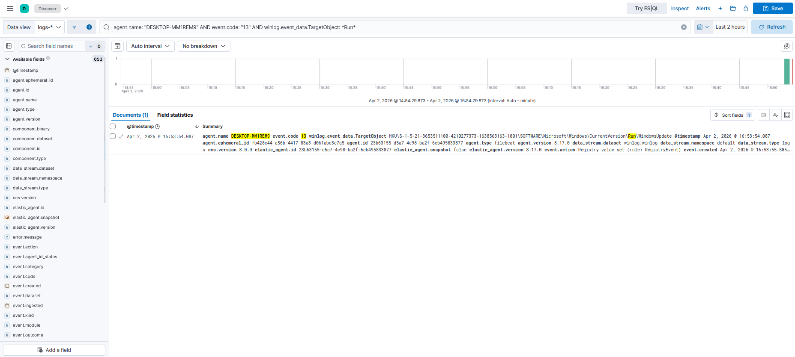
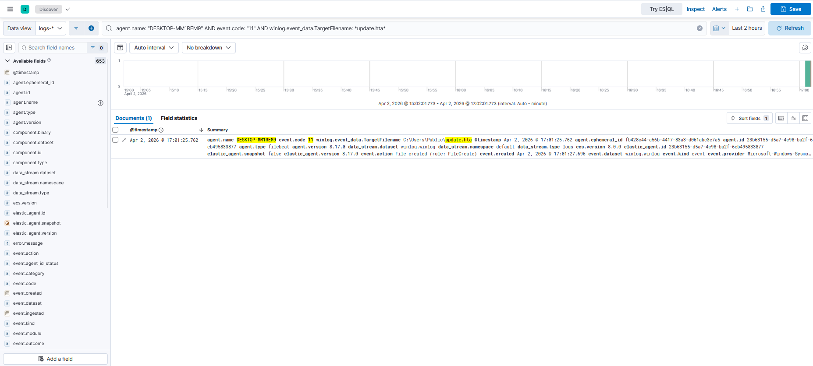
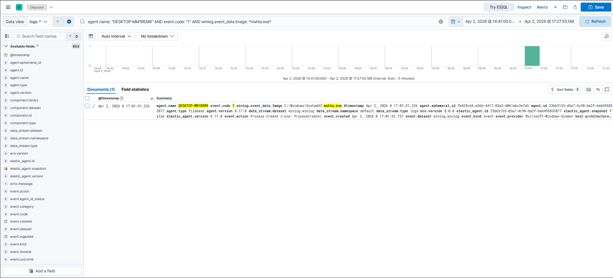
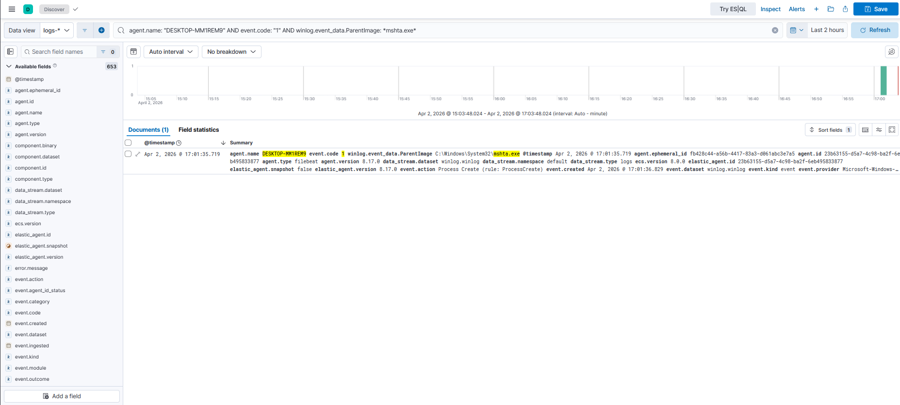

# IR-004: Defense Evasion and Persistence

**Classification:** Controlled Simulation
**Analyst:** Farrukh Ejaz
**Date:** 2026-04-02
**Status:** Closed
**Severity:** High
**Host:** DESKTOP-MM1REM9 (10.0.20.10), Windows 10 Pro 22H2
**MITRE ATT&CK:** T1218.005, T1547.001, T1562.001, T1036
**Connected Narrative:** This report continues from IR-003 (Encoded PowerShell Execution and C2 Beaconing). Following execution and C2 establishment, the threat actor moved to persistence and defense evasion. A registry Run key was written under a masqueraded name, a local .hta file was executed via mshta.exe producing a full parent-child process chain, and a Defender disable attempt was made via registry modification. This activity is reconstructed as part of the full kill chain in IR-005.

---

## 1. Executive Summary

On 2026-04-02, three distinct persistence and evasion techniques were observed on DESKTOP-MM1REM9 within a 25-minute window. First, a registry Run key named "WindowsUpdate" was written to the HKCU hive, masquerading as a legitimate update mechanism to establish user-level persistence. Second, a local HTA file (update.hta) was executed via mshta.exe, producing a parent-child process chain (mshta.exe -> cmd.exe) fully visible in Sysmon telemetry. Third, an attempt to disable Windows Defender real-time monitoring was made via registry modification.

All three techniques use native Windows binaries or built-in registry mechanisms. Windows Defender did not block any of these activities. The defense evasion attempt via `Set-MpPreference` was silently blocked by Tamper Protection before reaching the registry. A subsequent direct registry write to `HKLM\SOFTWARE\Policies\Microsoft\Windows Defender` was captured by Sysmon EID 13, documenting the attempt regardless of outcome.

**Worst case if real:** Registry persistence survives reboots and executes under the user context automatically at logon. The mshta LOLBin chain provides a scriptable execution vehicle that blends with legitimate Windows activity. A successful Defender disable would remove the primary preventive control, enabling subsequent malware deployment without interference.

---

## 2. Technical Detail

**Audience:** IR team and detection engineers

---

### Methodology

**Collection:**
EDR telemetry via Sysmon EID 1 (process creation), EID 11 (file creation), EID 13 (registry value set) shipped via Elastic Agent 8.17.0. Analysis performed in Kibana Discover using `winlog.event_data.*` field queries against logs-winlog.winlog-default index.

**Analysis:**
Three distinct attack stages identified and correlated chronologically. Registry Run key confirmed via EID 13 TargetObject field. mshta parent-child chain confirmed by matching ProcessGuid (mshta.exe) to ParentProcessGuid (child cmd.exe). These GUIDs are the IR-005 pivot anchor. Defender tamper attempt confirmed via EID 13 on Windows Defender policy registry key.

**Enrichment:**
- Registry Run key "WindowsUpdate" -> T1547.001 (Registry Run Keys), T1036 (Masquerading)
- mshta.exe executing local .hta -> T1218.005 (Mshta LOLBin)
- Defender disable attempt -> T1562.001 (Impair Defenses)

**Conclusion:**
All three persistence and evasion TTPs confirmed in telemetry. The mshta parent-child chain is intact and provides the primary pivot for IR-005 ProcessGuid correlation. The Defender disable attempt is documented as a detected evasion attempt. It did not succeed at the PowerShell layer but a subsequent registry write was captured.

---

### Baseline and Tripwires

**Network baseline:**
No network activity associated with this phase. All techniques are host-local.

**Endpoint baseline:**
Sysmon registry monitoring (EID 13) captured all three registry write events. `reg add` and `mshta.exe` are native binaries. Defender does not block them. The inline `mshta vbscript:Execute(...)` syntax is flagged as Trojan.Powessere.G by Defender on Windows 10 22H2. A local .hta file was used instead, which has a significantly lower detection profile and generates richer Sysmon telemetry.

**Investigation type:**
Proactive investigation continuing from IR-003 timeline.

---

### Breach Chain

**Initial access:**
Assumed via existing elevated session continuing from IR-003.

**Step 1: Registry Run key persistence (T1547.001, T1036)**
`reg add` wrote value "WindowsUpdate" to `HKCU\Software\Microsoft\Windows\CurrentVersion\Run` with payload `cmd.exe /c whoami > C:\Users\Public\out.txt`. Value name masquerades as a legitimate Windows Update mechanism. Captured by Sysmon EID 13 at 16:53:54.

**Step 2: mshta LOLBin execution (T1218.005)**
A local HTA file (update.hta) was written to `C:\Users\Public\` via cmd.exe at 17:01:25 (EID 11). mshta.exe was invoked to execute the file at 17:01:31 (EID 1). mshta.exe spawned cmd.exe as a child process at 17:01:35 (EID 1) with CommandLine `cmd.exe /c whoami >> C:\Users\Public\out.txt`. Full parent-child chain visible in telemetry.

**Step 3: Defender disable attempt (T1562.001)**
`Set-MpPreference -DisableRealtimeMonitoring $true` was executed but silently blocked by Windows Tamper Protection before reaching the registry. No EID 13 generated for this attempt. A subsequent direct registry write via `reg add HKLM\SOFTWARE\Policies\Microsoft\Windows Defender /v DisableAntiSpyware /t REG_DWORD /d 1` bypassed Tamper Protection and was captured by Sysmon EID 13 at 17:18:17.

**Privilege context:**
All activity under `DESKTOP-MM1REM9\victim`, High integrity level.

**Data exfiltration:**
None observed.

---

### Timeline (UTC)

| Timestamp | Event ID | Source | Key Fields | MITRE |
|---|---|---|---|---|
| 2026-04-02T16:53:54 | 13 | Sysmon (EDR) | TargetObject: HKCU\...\CurrentVersion\Run\WindowsUpdate, Image: reg.exe | T1547.001, T1036 |
| 2026-04-02T17:01:25 | 11 | Sysmon (EDR) | TargetFilename: C:\Users\Public\update.hta, Image: cmd.exe | T1218.005 |
| 2026-04-02T17:01:31 | 1 | Sysmon (EDR) | Image: mshta.exe, CommandLine: mshta C:\Users\Public\update.hta, ProcessGuid: {c466df0a-5a9b-69ce-600a-000000000a00} | T1218.005 |
| 2026-04-02T17:01:35 | 1 | Sysmon (EDR) | Image: cmd.exe, ParentImage: mshta.exe, ParentProcessGuid: {c466df0a-5a9b-69ce-600a-000000000a00}, ProcessGuid: {c466df0a-5a9f-69ce-610a-000000000a00} | T1218.005 |
| 2026-04-02T17:18:17 | 13 | Sysmon (EDR) | TargetObject: HKLM\SOFTWARE\Policies\Microsoft\Windows Defender\DisableAntiSpyware, Image: reg.exe | T1562.001 |

---

### Notable Observations

- The Run key value name "WindowsUpdate" is a classic T1036 masquerading technique. In a high-volume environment this would blend with legitimate update activity. Detection requires registry path monitoring rather than value name matching.
- `Set-MpPreference -DisableRealtimeMonitoring $true` was silently blocked by Tamper Protection with no Sysmon EID 13 generated. This is a detection blind spot, as the attempt leaves no telemetry trail at the registry layer. The direct registry write via `reg add` to the Policies hive succeeded in generating an EID 13, but only because a different attack path was used. Document this as a detection engineering finding.
- The mshta.exe ProcessGuid (`{c466df0a-5a9b-69ce-600a-000000000a00}`) and child cmd.exe ProcessGuid (`{c466df0a-5a9f-69ce-610a-000000000a00}`) are the critical IR-005 pivot anchors. These GUIDs link the LOLBin execution chain to the broader kill chain timeline.
- Local .hta file execution via mshta produces three distinct Sysmon events: EID 11 (file write), EID 1 (mshta process), EID 1 (child cmd). This is significantly richer telemetry than inline vbscript execution, which would produce only a single EID 1 if not blocked.
- The 17-minute gap between mshta execution (17:01) and Defender tamper attempt (17:18) reflects deliberate operator pacing, consistent with manual interactive activity rather than automated tooling.

---

### Screenshots

- 
- 
- 
- 
- 

---

## 3. Gaps and Remediation

### Detection Gaps

**Gap 1: Set-MpPreference Tamper Protection blind spot**
`Set-MpPreference -DisableRealtimeMonitoring $true` is silently blocked by Tamper Protection with no Sysmon EID 13 generated. The attempt leaves no telemetry trail at the registry layer. An analyst relying solely on EID 13 for Defender tamper detection would miss this technique entirely.

**Fix:**
Monitor PowerShell command line for Defender tampering attempts regardless of outcome:
```
agent.name: "DESKTOP-MM1REM9" AND event.code: "1" AND winlog.event_data.CommandLine: *DisableRealtimeMonitoring*
```
This catches the attempt at process creation level even when the registry write is blocked.

**Gap 2: No alert on Run key write**
EID 13 captured the registry write but no detection rule fired. The value name "WindowsUpdate" would evade name-based detection entirely.

**Fix:**
```
agent.name: "DESKTOP-MM1REM9" AND event.code: "13" AND winlog.event_data.TargetObject: *CurrentVersion\\Run*
```
Alert on any write to the Run key regardless of value name. Review all new Run key entries against a known-good baseline.

**Gap 3: No alert on mshta executing local .hta**
mshta.exe is a legitimate Windows binary. Local .hta execution is not blocked by Defender by default. The detection signal is the parent-child chain, as mshta spawning cmd.exe is anomalous in most environments.

**Fix:**
```
agent.name: "DESKTOP-MM1REM9" AND event.code: "1" AND winlog.event_data.ParentImage: *mshta.exe*
```
Any child process spawned by mshta.exe should be treated as suspicious and investigated.

---

### Remediation

- Remove Run key value "WindowsUpdate" from HKCU\Software\Microsoft\Windows\CurrentVersion\Run
- Delete `C:\Users\Public\update.hta` and `C:\Users\Public\out.txt`
- Remove registry key `HKLM\SOFTWARE\Policies\Microsoft\Windows Defender\DisableAntiSpyware`
- Verify Defender Tamper Protection is enabled and real-time monitoring is active
- Revert victim VM to clean snapshot before IR-005 analysis

---

### Mitigation

- Block mshta.exe via Attack Surface Reduction rules in production environments
- Monitor all writes to HKCU and HKLM Run keys via EID 13
- Alert on PowerShell CommandLine containing Defender configuration cmdlets
- Implement application allowlisting to restrict .hta file execution
- Monitor `C:\Users\Public\` for executable file writes
- Enable Windows Defender Tamper Protection and verify EID 13 coverage for policy-based disable attempts
