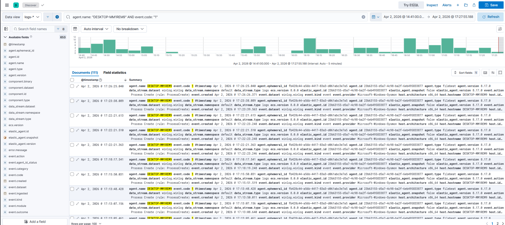
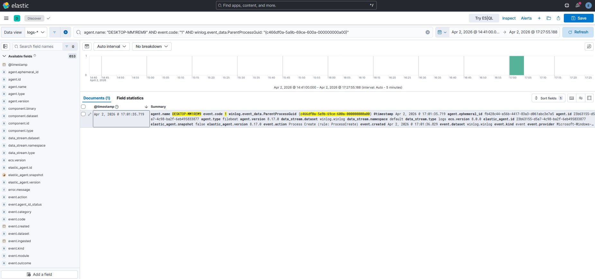
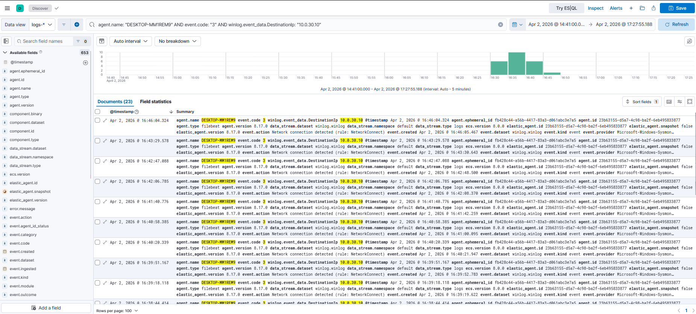
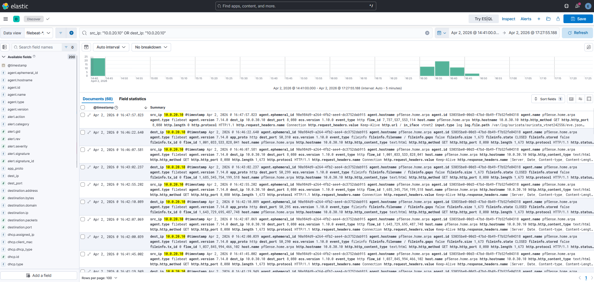

# IR-005: Correlated Kill Chain Hunt

**Classification:** Controlled Simulation
**Analyst:** Farrukh Ejaz
**Date:** 2026-04-02
**Status:** Closed
**Severity:** Critical
**Host:** DESKTOP-MM1REM9 (10.0.20.10) — Windows 10 Pro 22H2
**MITRE ATT&CK:** T1046, T1082, T1033, T1016, T1059.001, T1027, T1071.001, T1105, T1218.005, T1547.001, T1562.001, T1036
**Connected Narrative:** This report is the culmination of the IR-002 through IR-004 kill chain. No new attack activity was conducted. This is a pure analyst exercise reconstructing the full attack timeline across both EDR and NDR pipelines using three defined pivot points. IR-005 serves as the portfolio centrepiece demonstrating cross-layer correlation, ProcessGuid chaining, and timeline reconstruction from a single NDR alert anchor.

---

## 1. Executive Summary

On 2026-04-02, a correlated threat hunt was conducted across Suricata NDR telemetry (filebeat-* index) and Sysmon EDR telemetry (logs-winlog.winlog-default index) covering a kill chain that began at 14:41 and concluded at 17:18 — a total dwell window of approximately two hours and 37 minutes on a single host.

Starting from a single Suricata alert (SID 9000001, T=0 at 14:41:40), the investigation reconstructed the full attack sequence: external network scan, internal host enumeration, encoded PowerShell execution, jittered C2 beaconing, file staging, LOLBin persistence, and a Defender disable attempt. Every stage was traceable through telemetry without requiring additional tooling or agent deployment.

Three pivot points anchored the investigation: a timestamp anchor from the initial NDR alert, a ProcessGuid parent-child chain linking mshta.exe to its child cmd.exe, and a cross-layer correlation matching Sysmon EID 3 network events against Suricata HTTP flow records for the same source and destination IPs.

**Significance:** This hunt demonstrates that a complete kill chain reconstruction is achievable using only Sysmon and Suricata telemetry, without NGAV, EDR commercial tooling, or threat intelligence feeds. The ability to pivot from a network alert into endpoint process chains and back to network flows is the core analytical skill this investigation validates.

---

## 2. Technical Detail

**Audience:** IR team and detection engineers

---

### Methodology

**Collection:**
All telemetry sourced from existing IR-002 through IR-004 investigation windows. No new data collection performed. Kibana Discover used exclusively with field-based KQL queries. Time range set to 2026-04-02 14:41 → 17:30 covering full kill chain window.

**Analysis approach:**
Three structured pivot points executed in sequence:

**Pivot 1 — Timeline anchor:** Suricata SID 9000001 timestamp used as T=0. All Sysmon EID 1 events from DESKTOP-MM1REM9 pulled across the full kill chain window to establish the complete process execution timeline.

**Pivot 2 — ProcessGuid parent-child chain:** mshta.exe ProcessGuid from IR-004 used as query parameter against ParentProcessGuid field. Confirmed child cmd.exe spawned directly by mshta.exe, establishing the LOLBin execution chain.

**Pivot 3 — Cross-layer correlation:** Sysmon EID 3 events (DestinationIp: 10.0.30.10) matched against Suricata EVE HTTP flow records (src_ip: 10.0.20.10) in overlapping timestamp windows. Same actor, same IPs, independently seen by two separate detection systems.

---

### Kill Chain Reconstruction

#### Stage 1 — Initial Scan (T=0, 14:41)
**Source:** Suricata NDR (filebeat-*)
**Query:** `suricata.eve.alert.signature_id: 9000001`
**Result:** 26 alert records. First hit at 14:41:40. src_ip: 10.0.30.10, dest_ip: 10.0.20.10.

This is the earliest observable indicator of the attack. The Suricata alert predates any EDR activity by approximately four minutes, confirming the attacker performed external network reconnaissance before moving to the host. The alert timestamp becomes T=0 for all subsequent pivots.

#### Stage 2 — Host Enumeration (14:45 - 14:52)
**Source:** Sysmon EDR (logs-*)
**Query:** `agent.name: "DESKTOP-MM1REM9" AND event.code: "1" AND winlog.event_data.Image: (*whoami.exe* OR *net.exe* OR *systeminfo.exe* OR *ipconfig.exe* OR *arp.exe* OR *netstat.exe* OR *route.exe* OR *tasklist.exe* OR *netstat.exe*)`
**Result:** 9 EID 1 events across a seven-minute window.

All nine recon binaries share ParentProcessGuid `{c466df0a-c199-69cc-5006-000000000a00}`, confirming execution from a single operator-controlled PowerShell session. The four-minute gap between T=0 (NDR scan) and first recon binary (14:45) reflects the operator reviewing scan results before proceeding.

#### Stage 3 — Encoded Execution (16:11 - 16:14)
**Source:** Sysmon EDR (logs-*)
**Query:** `agent.name: "DESKTOP-MM1REM9" AND event.code: "1" AND winlog.event_data.CommandLine: *hidden*`
**Result:** 2 EID 1 events. CommandLine: `powershell.exe -w hidden -nop -enc dwBoAG8A...`

Note: `*-enc*` wildcard returns empty on this Elastic build due to field tokenization. `*hidden*` is the confirmed working detection query. The 79-minute gap between recon (14:52) and execution (16:11) reflects dwell time consistent with operator planning between phases.

#### Stage 4 — C2 Beaconing (16:31 - 16:47)
**Source (EDR):** Sysmon EID 3 — `agent.name: "DESKTOP-MM1REM9" AND event.code: "3" AND winlog.event_data.DestinationIp: "10.0.30.10"`
**Result:** 23 EID 3 events, DestinationPort: 8080, consistent 25-45 second jitter.

**Source (NDR):** Suricata HTTP flows — `src_ip: "10.0.20.10" AND http.http_method: GET`
**Result:** 23 HTTP GET records, dest: 10.0.30.10:8080, User-Agent: Mozilla/5.0.

**Cross-layer match:** 23 EID 3 events (EDR) and 23 HTTP GET records (NDR) with matching source/destination IPs and overlapping timestamps. This is the cross-layer smoking gun — the same C2 channel independently confirmed by two separate detection systems with no coordination between them.

#### Stage 5 — File Staging (16:46)
**Source:** Sysmon EDR (logs-*)
**Query:** `agent.name: "DESKTOP-MM1REM9" AND event.code: "11" AND winlog.event_data.TargetFilename: *update.bat*`
**Result:** 1 EID 11 event. TargetFilename: C:\Users\Public\update.bat, Image: powershell.exe.

#### Stage 6 — Persistence (16:53 - 17:01)
**Source:** Sysmon EDR (logs-*)
**Query:** `agent.name: "DESKTOP-MM1REM9" AND event.code: "13" AND winlog.event_data.TargetObject: *CurrentVersion\\Run*`
**Result:** 1 EID 13 event. TargetObject: HKCU\...\Run\WindowsUpdate, confirming registry persistence.

**Query:** `agent.name: "DESKTOP-MM1REM9" AND event.code: "1" AND winlog.event_data.ParentImage: *mshta.exe*`
**Result:** 1 EID 1 event. Image: cmd.exe, ParentImage: mshta.exe — LOLBin chain confirmed.

#### Stage 7 — Defense Evasion (17:18)
**Source:** Sysmon EDR (logs-*)
**Query:** `agent.name: "DESKTOP-MM1REM9" AND event.code: "13" AND winlog.event_data.TargetObject: *Windows Defender*`
**Result:** 1 EID 13 event. TargetObject: HKLM\SOFTWARE\Policies\Microsoft\Windows Defender\DisableAntiSpyware. Evasion attempt documented regardless of partial success.

---

### ProcessGuid Chain (Pivot 2)

The mshta parent-child chain is the structural spine of this kill chain reconstruction:

| Role | Image | ProcessGuid |
|---|---|---|
| Parent | mshta.exe | {c466df0a-5a9b-69ce-600a-000000000a00} |
| Child | cmd.exe | {c466df0a-5a9f-69ce-610a-000000000a00} |

Query used to confirm chain:
```
agent.name: "DESKTOP-MM1REM9" AND event.code: "1" AND winlog.event_data.ParentProcessGuid: "{c466df0a-5a9b-69ce-600a-000000000a00}"
```
Result: 1 hit — cmd.exe with CommandLine `cmd.exe /c whoami >> C:\Users\Public\out.txt`. Chain intact.

---

### Cross-Layer Correlation Summary (Pivot 3)

| Layer | Source | Events | IPs | Timestamps |
|---|---|---|---|---|
| EDR | Sysmon EID 3 | 23 | 10.0.20.10 → 10.0.30.10:8080 | 16:31 - 16:47 |
| NDR | Suricata EVE HTTP | 23 | 10.0.20.10 → 10.0.30.10:8080 | 16:31 - 16:47 |

Same count, same IPs, same window. Independent confirmation across both pipelines with no shared data path between Sysmon and Suricata.

---

### Full Kill Chain Timeline (UTC)

| Timestamp | Stage | Event ID | Source | Key Indicator | MITRE |
|---|---|---|---|---|---|
| 14:41:40 | Recon — External | Alert | Suricata | SID 9000001, src: 10.0.30.10 | T1046 |
| 14:45:15 | Recon — Internal | 1 | Sysmon | whoami.exe, ParentGuid: {c466df0a-c199...} | T1033 |
| 14:46:11 | Recon — Internal | 1 | Sysmon | net.exe user | T1033 |
| 14:48-14:52 | Recon — Internal | 1 (x7) | Sysmon | systeminfo, ipconfig, route, arp, tasklist, netstat | T1082, T1016 |
| 16:11:25 | Execution | 1 | Sysmon | powershell.exe -w hidden -nop -enc | T1027, T1059.001 |
| 16:31:41 | C2 Beaconing | 3 + Flow | Sysmon + Suricata | EID3 + HTTP GET to 10.0.30.10:8080 (x23) | T1071.001 |
| 16:46:03 | File Staging | 11 | Sysmon | update.bat → C:\Users\Public\ | T1105 |
| 16:53:54 | Persistence | 13 | Sysmon | HKCU Run\WindowsUpdate | T1547.001, T1036 |
| 17:01:25 | LOLBin | 11 | Sysmon | update.hta created | T1218.005 |
| 17:01:31 | LOLBin | 1 | Sysmon | mshta.exe → update.hta | T1218.005 |
| 17:01:35 | LOLBin | 1 | Sysmon | cmd.exe child of mshta.exe | T1218.005 |
| 17:18:17 | Evasion | 13 | Sysmon | Defender DisableAntiSpyware registry write | T1562.001 |

---

### Notable Observations

- The full kill chain spans 2 hours 37 minutes on a single host with Defender ON and UAC ON throughout. No malware was used. Every technique relied on native Windows binaries or built-in OS features. This is a realistic simulation of LOLBin-based pre-ransomware operator behavior.
- The four-minute gap between T=0 (NDR scan) and first EDR recon activity demonstrates why NDR and EDR must be correlated — an analyst watching only EDR would miss the earliest indicator of attack by four minutes. An analyst watching only NDR would see the scan but have no visibility into what happened on the host afterward.
- The 79-minute gap between recon completion (14:52) and execution start (16:11) represents operator dwell time. In a real investigation this gap is where analysts look for additional activity that may not have been captured — lateral movement attempts, credential access, or communication with external infrastructure.
- `*-enc*` KQL wildcard fails silently on this Elastic build. This is a detection engineering finding with production implications — any deployment relying on `-enc` flag detection in Elasticsearch may have undetected blind spots depending on field mapping and tokenization configuration.
- The cross-layer correlation result (23 EDR events, 23 NDR records, matching IPs, overlapping timestamps) is the strongest evidentiary finding in this investigation. It demonstrates that the C2 channel is not an artifact of a single sensor — it is independently confirmed by two separate detection systems with different data paths, different collection mechanisms, and different storage indices.

---

### Screenshots

- 
- 
- 
- 

---

## 3. Gaps and Remediation

### Detection Gaps

**Gap 1: No single alert covering the full kill chain**
Each IR phase (002-004) had individual detection gaps. At no point did a single alert fire that would have triggered an investigation covering the full sequence. An analyst without proactive hunting capability would likely have seen fragments — the Suricata SID 9000001 alert, possibly the Run key write — but not the connected narrative.

**Fix:**
Implement a correlation rule that links NDR scan alerts to subsequent EDR recon binary activity within a defined time window. A scan from 10.0.30.0/24 followed by recon binaries on 10.0.20.10 within 30 minutes should generate a high-severity correlated alert.

**Gap 2: 79-minute dwell window with no detection**
Between the end of recon (14:52) and execution start (16:11), no alerts fired and no hunting queries would have returned results. This window is blind.

**Fix:**
Implement time-based behavioral analytics. A host that generated 9 recon binary events in a burst should remain in an elevated monitoring state for a configurable period. Any subsequent PowerShell execution within that window should auto-escalate.

**Gap 3: KQL field tokenization breaks -enc detection**
Documented across IR-003 and IR-005. The `*-enc*` wildcard against `winlog.event_data.CommandLine` returns empty. Production detection rules using this pattern will silently fail.

**Fix:**
Audit all detection rules that rely on `-enc` wildcard matching. Replace with `*hidden*` or use `winlog.event_data.CommandLine: *nop*` as alternative indicators. Test all new detection rules against known-good telemetry before deploying.

**Gap 4: No automated cross-layer correlation**
The cross-layer correlation in this report was performed manually — analyst queried EDR and NDR separately and compared results. In a high-volume production environment this manual process does not scale.

**Fix:**
Build a Kibana dashboard that displays EID 3 events and Suricata HTTP flows side by side, filtered to the same source IP and time window. This enables rapid visual correlation without manual query switching. (Planned for Phase 9.)

---

### Remediation

- All remediation actions documented in IR-002 through IR-004 apply
- Revert victim VM to victim-ready-baseline-v2 snapshot
- Verify Suricata ruleset is intact and SID 9000001 active
- Verify Filebeat and Elastic Agent pipelines healthy before next session

---

### Mitigation

- Implement correlated detection spanning NDR scan events and EDR recon activity
- Build time-windowed behavioral escalation for hosts with recent recon activity
- Audit and fix all `-enc` based detection rules in Kibana
- Deploy Kibana cross-layer correlation dashboard (Phase 9)
- Establish network baselines to enable anomaly detection on C2 beaconing patterns
- Enforce PowerShell Constrained Language Mode and Script Block Logging in production
- Block mshta.exe and restrict LOLBin execution via ASR rules
- Monitor all Run key writes regardless of value name