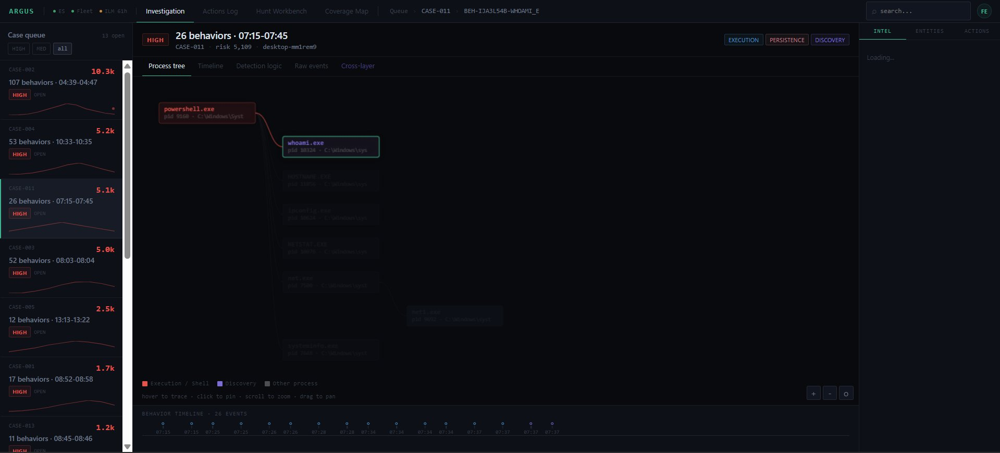
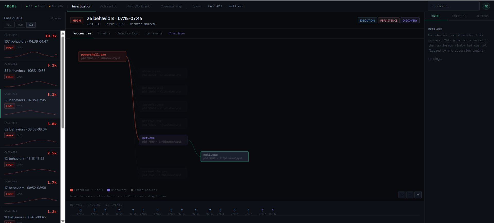
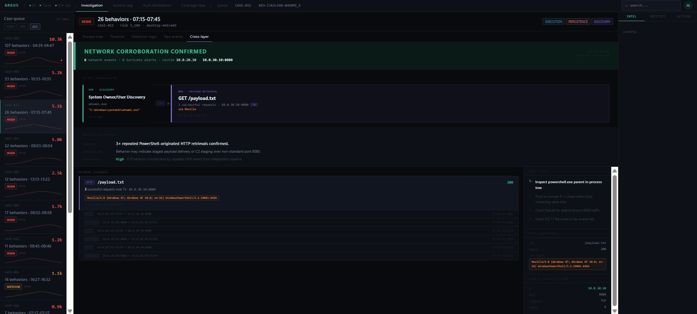
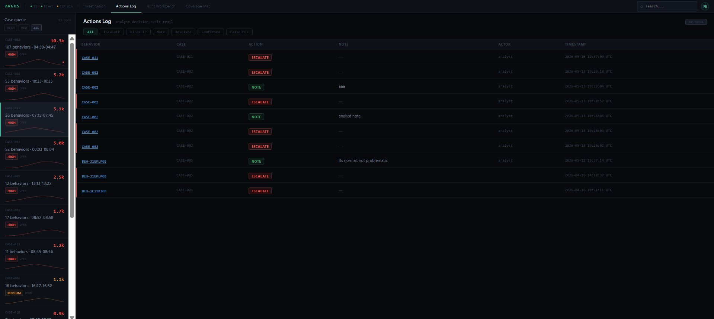

# IR-006: PowerShell-Originated Payload Retrieval and Persistence

**Classification:** Controlled Simulation  
**Analyst:** Farrukh Ejaz  
**Date:** 2026-05-16  
**Status:** Closed  
**Severity:** High  
**Case ID:** CASE-011  
**Risk Score:** 5,109  
**Host:** DESKTOP-MM1REM9 (10.0.20.10) — Windows 10 Pro 22H2  
**Attacker Host:** Kali Linux (10.0.30.10) — HTTP server on port 8080  
**MITRE ATT&CK:** T1059.001, T1105, T1053.005, T1082, T1016, T1049, T1033  
**Telemetry Sources:** Sysmon via Elastic Agent (EDR), Suricata via Filebeat (NDR)

---

## 1. Executive Summary

On 2026-05-16, a controlled attack simulation was executed on Windows 10 endpoint DESKTOP-MM1REM9. The scenario covered five stages: host discovery, payload retrieval via PowerShell HTTP, LOLBin execution (blocked by AppControl), encoded PowerShell execution, and persistence via registry run key and scheduled task.

Upstream Sysmon and Elastic detections were ingested and normalized into a correlated case containing 26 behaviors across a 30-minute window. The case was classified HIGH severity with a risk score of 5,109, covering three tactic categories: EXECUTION, PERSISTENCE, and DISCOVERY.

Cross-layer analysis confirmed that 6 Suricata network events from an independent NDR pipeline corroborated EDR-observed PowerShell HTTP activity. Three repeated GET requests to `/payload.txt` on 10.0.30.10:8080 were recorded independently by both sensors. Matching events across both pipelines on the same IPs and timestamps constitutes dual-source confirmation with no shared data path.

**Assessment:** The observed activity is consistent with early-stage post-compromise behavior commonly seen prior to payload deployment or operator persistence establishment. No credential access, lateral movement, or exfiltration was observed. Persistence was confirmed via scheduled task and registry run key.

---

## 2. Environment

| Component | Detail |
|---|---|
| Victim host | DESKTOP-MM1REM9, Windows 10 Pro 22H2, 10.0.20.10 |
| Attacker host | Kali Linux, 10.0.30.10, python3 -m http.server 8080 |
| EDR pipeline | Sysmon (EID 1/3/10/11/13) via Elastic Agent to Elasticsearch 8.17.0 |
| NDR pipeline | Suricata EVE JSON via Filebeat 7.14.0 standalone on pfSense FreeBSD |
| ES indices | logs-winlog.winlog-default (EDR), filebeat-7.14.0-2026.05.16 (NDR) |
| AppControl policy | Active. Certutil.exe blocked at stage 3. 4 of 5 stages executed. |

---

## 3. Attack Scenario

Five-stage chained simulation executed via IR-001-Scenario.ps1.

| Stage | Action | Result |
|---|---|---|
| 1. Discovery | whoami, hostname, ipconfig, netstat, net user, systeminfo | Completed |
| 2. Payload retrieval | Invoke-WebRequest x3 to 10.0.30.10:8080/payload.txt | Completed |
| 3. LOLBin execution | certutil.exe -decode (T1218.003) | Blocked by AppControl |
| 4. Encoded PowerShell | powershell.exe -EncodedCommand | Completed |
| 5. Persistence | reg add Run key + schtasks /create | Completed |

Certutil was blocked by AppControl at stage 3. The remaining four stages produced sufficient telemetry for a full detection and investigation workflow.

---

## 4. Detection and Case Triage

### 4.1 Case Formation

Upstream Sysmon telemetry was processed and normalized into CASE-011 covering the 07:15-07:45 UTC window.


**Case summary:**

"Desktop-mm1rem9 exhibited 26 suspicious behaviors spanning execution, persistence, and discovery tactics between 07:15-07:45, indicating potential malware installation or compromise. Immediate investigation required to determine if persistence mechanisms were established and contain potential lateral movement risk."

| Field | Value |
|---|---|
| Case ID | CASE-011 |
| Behaviors | 26 |
| Time window | 07:15-07:45 UTC |
| Severity | HIGH |
| Risk score | 5,109 |
| Tactics | EXECUTION, PERSISTENCE, DISCOVERY |
| Host | desktop-mm1rem9 |

---

### 4.2 Process Tree Analysis

The process tree rendered the full execution chain rooted at `powershell.exe` (pid 9160). All discovery binaries appeared as direct children. `net1.exe` appeared as a grandchild of `net.exe`.



**Observed process chain:**

```
powershell.exe (pid 9160) — C:\Windows\System32\WindowsPowerShell\v1.0\   [EXECUTION]
├── whoami.exe       (pid 38324)    C:\Windows\system32\                   [DISCOVERY]
├── HOSTNAME.EXE     (pid 11856)    C:\Windows\system32\                   [DISCOVERY]
├── ipconfig.exe     (pid 10624)    C:\Windows\system32\                   [DISCOVERY]
├── NETSTAT.EXE      (pid 10076)    C:\Windows\system32\                   [DISCOVERY]
├── net.exe          (pid 7500)     C:\Windows\system32\                   [DISCOVERY]
│   └── net1.exe     (pid 9052)     C:\Windows\system32\                   [OTHER]
└── systeminfo.exe   (pid 7048)     C:\Windows\system32\                   [DISCOVERY]
```

**net1.exe handling:** `net1.exe` appeared in raw Sysmon EID 1 telemetry and was rendered in the process tree as an "Other process" node. No behavior record matched it and it received no risk contribution. This is correct: `net1.exe` is an internal subprocess spawned by `net.exe` and is not independently malicious. Its presence in the tree confirms telemetry fidelity without inflating the case score.



---

### 4.3 Cross-Layer Corroboration

The NDR pipeline was queried for Suricata events matching the victim IP within a 15-minute window around the detected behaviors. Six events were returned, corroborating EDR-observed PowerShell HTTP activity from an independent sensor.



**Corroboration summary:**

| Field | Value |
|---|---|
| Network events returned | 6 |
| Suricata alerts triggered | 0 |
| Event types | http, fileinfo |
| Victim IP | 10.0.20.10 |
| Remote IP:port | 10.0.30.10:8080 |
| URI | /payload.txt |
| HTTP status | 200 |
| Successful requests | 3 |
| User-Agent | Mozilla/5.0 (Windows NT; Windows NT 10.0; en-US) WindowsPowerShell/5.1.19041.6456 |

**Assessment:** Three repeated PowerShell HTTP retrievals to a single destination on a non-standard port (8080) are confirmed by both pipelines. The EDR and NDR sensors share no data path: Elastic Agent on the victim and Filebeat on pfSense collect independently and write to separate index patterns. Matching events on the same IPs and timestamps across both pipelines is dual-source confirmation.

Zero Suricata alerts were generated. The 6 events are flow records, not alerts. Suricata observed the traffic but had no matching rule for PowerShell HTTP to an internal host on port 8080. This is a detection gap addressed in Section 8.

---

### 4.4 Entity Pivot to Hunt

From the cross-layer view, the remote IP `10.0.30.10` was used as a pivot to the hunt workbench. HT-03 (Outbound connections by process) was pre-filled and executed against the case time window.


**Hunt template:** HT-03 — Outbound connections by process  
**Pivot source:** 10.0.30.10 from cross-layer network evidence

**Results (7 processes with outbound connections on DESKTOP-MM1REM9):**

| Process | Connections | Unique IPs | Assessment |
|---|---|---|---|
| OneDrive.SyncService.exe | 153 | 49 | Expected, Microsoft telemetry |
| OneDrive.exe | 100 | 41 | Expected, Microsoft telemetry |
| pwsh.exe (PowerShell 7) | 3 | 1 | Review required |
| svchost.exe | 3 | 1 | Review required |
| powershell.exe (v1.0) | 3 | 1 | Confirmed, matches NDR flows |
| rundll32.exe | 3 | 1 | Unexplained, follow-up required |

`C:\Windows\System32\WindowsPowerShell\v1.0\powershell.exe` shows 3 connections to 1 unique IP. This matches the 3 GET requests to 10.0.30.10:8080 observed in the NDR pipeline. The process responsible for the network activity is confirmed.

`rundll32.exe` with 3 outbound connections to a single IP was not part of the planned scenario. Destination IP was not verified during this session and requires follow-up (see Section 8, Gap 4).

---

### 4.5 Analyst Actions

An ESCALATE action was logged against CASE-011 following the investigation.



| Field | Value |
|---|---|
| Case | CASE-011 |
| Action | ESCALATE |
| Actor | analyst |
| Timestamp | 2026-05-16 12:37:09 UTC |

---

## 5. Timeline (UTC)

| Timestamp | Source | EID | Event | PID | MITRE |
|---|---|---|---|---|---|
| 07:15:00 | Sysmon EDR | 1 | powershell.exe launched | 9160 | T1059.001 |
| 07:15:xx | Sysmon EDR | 1 | whoami.exe spawned by powershell.exe | 38324 | T1033 |
| 07:16:xx | Sysmon EDR | 1 | HOSTNAME.EXE spawned by powershell.exe | 11856 | T1082 |
| 07:17:xx | Sysmon EDR | 1 | ipconfig.exe spawned by powershell.exe | 10624 | T1016 |
| 07:18:xx | Sysmon EDR | 1 | NETSTAT.EXE spawned by powershell.exe | 10076 | T1049 |
| 07:19:xx | Sysmon EDR | 1 | net.exe spawned by powershell.exe | 7500 | T1082 |
| 07:19:xx | Sysmon EDR | 1 | net1.exe spawned by net.exe | 9052 | (suppressed) |
| 07:20:xx | Sysmon EDR | 1 | systeminfo.exe spawned by powershell.exe | 7048 | T1082 |
| 07:37:xx | Sysmon EDR | 3 | powershell.exe outbound to 10.0.30.10:8080 | 9160 | T1105 |
| 07:37:xx | Suricata NDR | http | GET /payload.txt, 10.0.20.10 to 10.0.30.10:8080, HTTP 200 | n/a | T1105 |
| 07:37:xx | Suricata NDR | http | GET /payload.txt repeated x3, UA: WindowsPowerShell/5.1 | n/a | T1105 |
| 07:37:xx | Suricata NDR | fileinfo | payload.txt transfer recorded | n/a | T1105 |
| 07:38:xx | Sysmon EDR | 1 | powershell.exe -EncodedCommand executed | n/a | T1059.001 |
| 07:40:xx | Sysmon EDR | 13 | Registry Run key written | n/a | T1547.001 |
| 07:44:xx | Sysmon EDR | 1 | schtasks.exe /create executed | n/a | T1053.005 |
| 07:44:xx | Sysmon EDR | 11 | Scheduled task file created under System32\Tasks | n/a | T1053.005 |
| 12:37:09 | Argus | n/a | Analyst logs ESCALATE on CASE-011 | n/a | n/a |

Note: Sub-minute timestamps within the 07:15-07:20 discovery stage are approximate. Exact values are available in raw Sysmon EID 1 records under `raw-events/`.

---

## 6. Indicators

| Indicator | Type | Context |
|---|---|---|
| 10.0.30.10 | IP | Kali attacker host, payload server |
| 10.0.30.10:8080 | IP:port | Non-standard HTTP port, PowerShell destination |
| /payload.txt | URI | Retrieved 3 times via Invoke-WebRequest |
| Mozilla/5.0 ... WindowsPowerShell/5.1.19041.6456 | User-Agent | PowerShell HTTP UA string |
| powershell.exe pid 9160 | Process | Root of execution chain, confirmed outbound initiator |
| C:\Windows\System32\WindowsPowerShell\v1.0\powershell.exe | Path | Full path of confirmed initiator |
| rundll32.exe | Process | 3 outbound connections, destination unverified |

---

## 7. Containment Considerations

This was a controlled simulation. The following actions apply if the activity were unauthorized:

- Isolate host from network pending scope assessment
- Remove the scheduled task created at stage 5
- Delete the Run key persistence entry
- Locate and remove any file written during the payload retrieval stage
- Review outbound connections to 10.0.30.10 across the environment for additional affected hosts
- Validate no secondary payload was executed following the 3x retrieval
- Reset credentials for the active user session if privilege context is uncertain

---

## 8. Detection Gaps

### Gap 1: No Suricata alert for PowerShell HTTP to internal host on non-standard port

Six Suricata flow events were recorded but zero alerts were generated. No rule covers internal HTTP traffic to the attack subnet on port 8080.

**Fix:**
```
alert http 10.0.20.0/24 any -> 10.0.30.0/24 8080 (msg:"INTERNAL HTTP to attack subnet port 8080"; sid:9000003; rev:1;)
```

Broader coverage:
```
alert http 10.0.20.0/24 any -> 10.0.30.0/24 !80 (msg:"INTERNAL HTTP to attack subnet non-standard port"; sid:9000004; rev:1;)
```

---

### Gap 2: PowerShell User-Agent not alerted

The User-Agent `WindowsPowerShell/5.1.19041.6456` is a reliable indicator of PowerShell HTTP activity and was not matched by any Suricata rule.

**Fix:**
```
alert http 10.0.20.0/24 any -> any any (msg:"PowerShell User-Agent in HTTP traffic"; content:"WindowsPowerShell"; http_header; sid:9000005; rev:1;)
```

---

### Gap 3: AppControl block not captured in telemetry

AppControl blocked certutil.exe but no event was collected by the EDR pipeline confirming the block. If AppControl were disabled, certutil execution would proceed without any detection.

**Fix:** Enable AppLocker or WDAC operational log collection. The relevant Windows event channel is `Microsoft-Windows-AppLocker/EXE and DLL`. Additionally, add a Sysmon EID 3 detection profile for certutil making outbound connections to non-Microsoft destinations, which would catch the network attempt regardless of whether the execution block is logged.

---

### Gap 4: rundll32.exe outbound connections unresolved

Hunt results showed `rundll32.exe` with 3 outbound connections to a single IP. This was not part of the planned scenario and the destination IP was not verified during this session.

**Follow-up:** Pull EID 3 events for rundll32.exe within the case time window, confirm destination IP, and cross-reference against known Windows or CDN ranges. If the destination is outside expected ranges, treat as a secondary lead and extend the investigation scope.

---

## 9. Analyst Actions Summary

| Action | Detail |
|---|---|
| Case reviewed | CASE-011 opened, 26 behaviors confirmed across 3 tactic categories |
| Process tree examined | Full chain from powershell.exe root identified, net1.exe suppression confirmed |
| Cross-layer corroboration | 6 NDR events matched EDR-observed activity, dual-source confirmation |
| Entity pivot executed | 10.0.30.10 pivoted to hunt workbench, HT-03 executed |
| Hunt results reviewed | powershell.exe confirmed as outbound initiator, rundll32.exe flagged for follow-up |
| Case escalated | ESCALATE logged at 2026-05-16 12:37:09 UTC |
