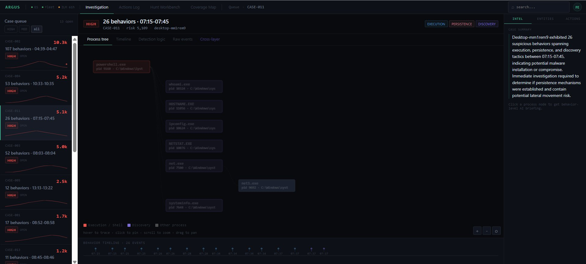
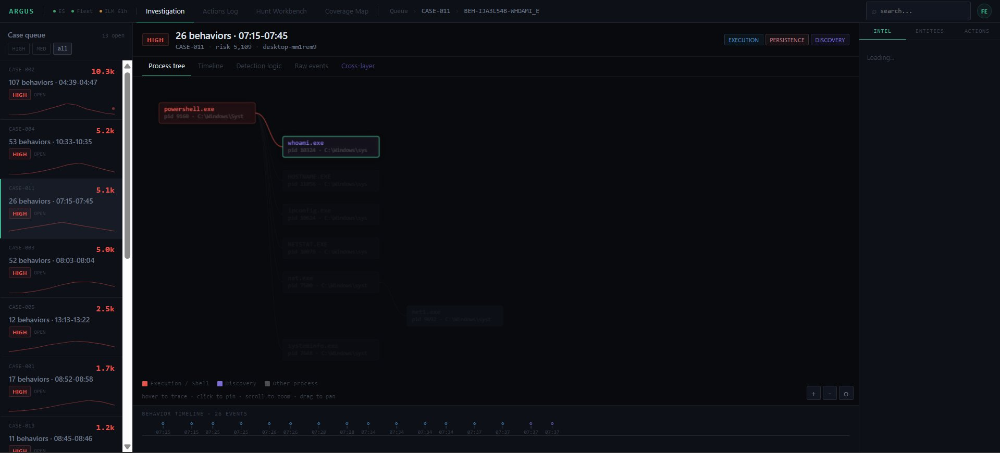
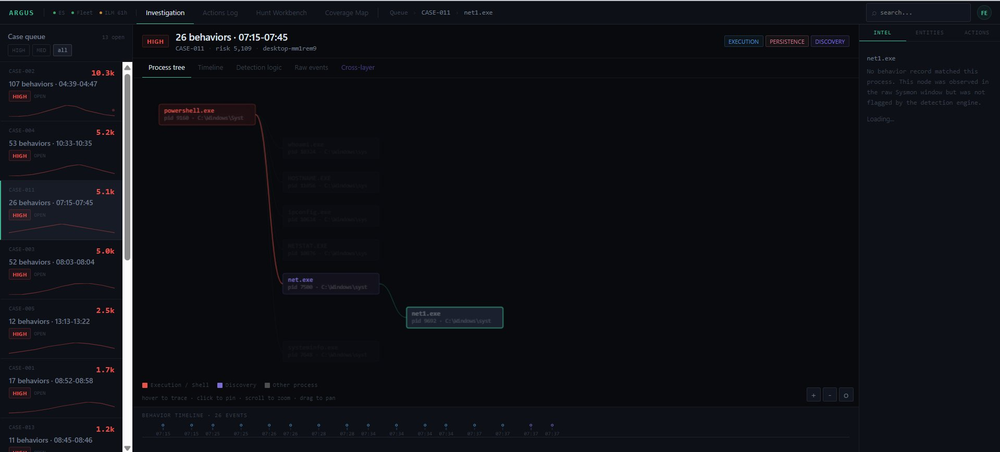
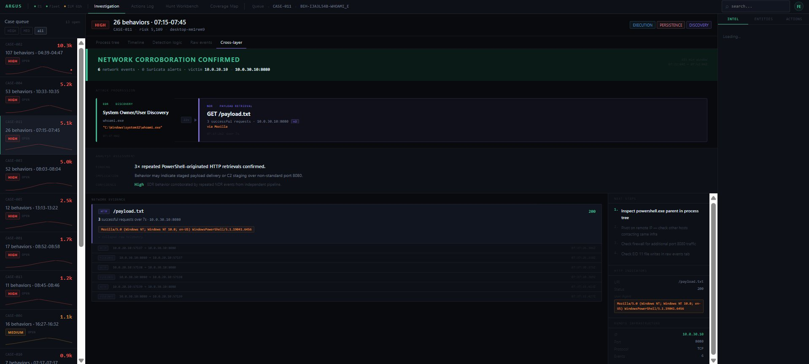
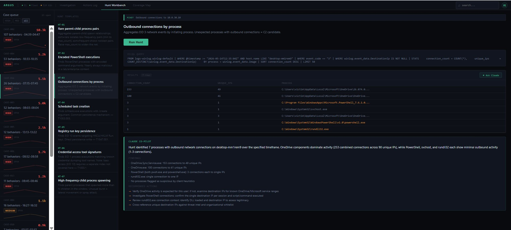
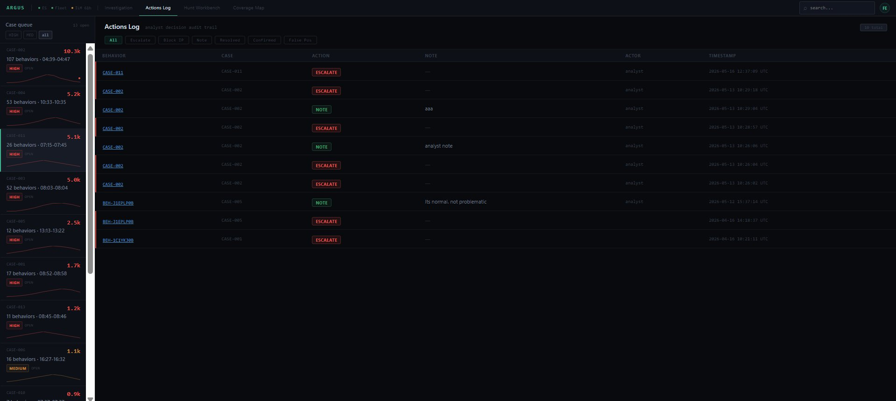

# IR-006: PowerShell Host Discovery and Payload Retrieval

**Classification:** Controlled Simulation  
**Analyst:** Farrukh Ejaz  
**Date:** 2026-05-16  
**Status:** Closed  
**Severity:** High  
**Case ID:** CASE-011  
**Risk Score:** 5,109  
**Host:** DESKTOP-MM1REM9 (10.0.20.10) — Windows 10 Pro 22H2  
**Attacker Host:** Kali Linux (10.0.30.10) — HTTP server on port 8080  
**MITRE ATT&CK:** T1059.001, T1105, T1082, T1016, T1049, T1033  
**Telemetry Sources:** Sysmon via Elastic Agent (EDR), Suricata via Filebeat (NDR)

---

## 1. Executive Summary

On 2026-05-16, a controlled attack simulation was executed on Windows 10 endpoint DESKTOP-MM1REM9. This report covers the two stages with independently verifiable telemetry: host discovery and payload retrieval via PowerShell HTTP.

Upstream Sysmon and Elastic detections were ingested and normalized into a correlated case (CASE-011) containing 26 behaviors across a 30-minute window, classified HIGH severity with a risk score of 5,109 and tagged across three tactic categories: EXECUTION, PERSISTENCE, and DISCOVERY. These figures are the Argus case classification itself (Section 4.1, confirmed directly by screenshot). This report independently walks through and evidences only the discovery and payload-retrieval activity within that case — it does not confirm what specifically drove the PERSISTENCE tag, since no supporting telemetry for later-stage activity is available (see Section 3).

Cross-layer analysis confirmed that 6 Suricata network events from an independent NDR pipeline corroborated EDR-observed PowerShell HTTP activity. Three repeated GET requests to `/payload.txt` on 10.0.30.10:8080 were recorded independently by both sensors. Matching events across both pipelines on the same IPs and timestamps constitutes dual-source confirmation with no shared data path.

**Assessment:** The observed activity is consistent with early-stage reconnaissance and payload staging. No credential access, lateral movement, execution beyond the observed process launches, or persistence was independently confirmed in this investigation.

---

## 2. Environment

| Component | Detail |
|---|---|
| Victim host | DESKTOP-MM1REM9, Windows 10 Pro 22H2, 10.0.20.10 |
| Attacker host | Kali Linux, 10.0.30.10, python3 -m http.server 8080 |
| EDR pipeline | Sysmon (EID 1/3) via Elastic Agent to Elasticsearch 8.17.0 |
| NDR pipeline | Suricata EVE JSON via Filebeat 7.14.0 standalone on pfSense FreeBSD |
| ES indices | logs-winlog.winlog-default (EDR), filebeat-7.14.0-2026.05.16 (NDR) |

---

## 3. Confirmed Activity

| Activity | Action | Evidence |
|---|---|---|
| Discovery | whoami, hostname, ipconfig, netstat, net, systeminfo | Process tree (Section 4.2), timeline (Section 5) |
| Payload retrieval | Invoke-WebRequest x3 to 10.0.30.10:8080/payload.txt | Cross-layer corroboration (Section 4.3), hunt pivot (Section 4.4) |

This report covers only the activity above, each independently confirmed by both a screenshot and a matching data point from at least one telemetry pipeline. Earlier drafts of this report also described LOLBin execution, encoded PowerShell execution, and persistence via registry run key and scheduled task. Those were removed: no screenshot, raw event, or queryable telemetry in this repository supports them, and the underlying raw Sysmon/Suricata indices for this case no longer exist to check.

---

## 4. Detection and Case Triage

### 4.1 Case Formation

Upstream Sysmon telemetry was processed and normalized into CASE-011 covering the 07:15-07:45 UTC window.



**Case summary:**

"Desktop-mm1rem9 exhibited 26 suspicious behaviors spanning execution, persistence, and discovery tactics between 07:15-07:45, indicating potential malware installation or compromise. Immediate investigation required to determine if persistence mechanisms were established and contain potential lateral movement risk."

| Field | Value |
|---|---|
| Case ID | CASE-011 |
| Behaviors | 26 |
| Time window | 07:15-07:45 UTC |
| Severity | HIGH |
| Risk score | 5,109 |
| Tactics | EXECUTION, PERSISTENCE, DISCOVERY |
| Host | desktop-mm1rem9 |

---

### 4.2 Process Tree Analysis

The process tree rendered the full execution chain rooted at `powershell.exe` (pid 9160). All discovery binaries appeared as direct children. `net1.exe` appeared as a grandchild of `net.exe`.



**Observed process chain:**

```
powershell.exe (pid 9160) — C:\Windows\System32\WindowsPowerShell\v1.0\   [EXECUTION]
├── whoami.exe       (pid 10324)    C:\Windows\system32\                   [DISCOVERY]
├── HOSTNAME.EXE     (pid 11056)    C:\Windows\system32\                   [DISCOVERY]
├── ipconfig.exe     (pid 10624)    C:\Windows\system32\                   [DISCOVERY]
├── NETSTAT.EXE      (pid 10076)    C:\Windows\system32\                   [DISCOVERY]
├── net.exe          (pid 7500)     C:\Windows\system32\                   [DISCOVERY]
│   └── net1.exe     (pid 9692)     C:\Windows\system32\                   [OTHER]
└── systeminfo.exe   (pid 7648)     C:\Windows\system32\                   [DISCOVERY]
```

**net1.exe handling:** `net1.exe` appeared in raw Sysmon EID 1 telemetry and was rendered in the process tree as an "Other process" node. No behavior record matched it and it received no risk contribution. This is correct: `net1.exe` is an internal subprocess spawned by `net.exe` and is not independently malicious. Its presence in the tree confirms telemetry fidelity without inflating the case score.



---

### 4.3 Cross-Layer Corroboration

The NDR pipeline was queried for Suricata events matching the victim IP within a 15-minute window around the detected behaviors. Six events were returned, corroborating EDR-observed PowerShell HTTP activity from an independent sensor.



**Corroboration summary:**

| Field | Value |
|---|---|
| Network events returned | 6 |
| Suricata alerts triggered | 0 |
| Event types | http, fileinfo |
| Victim IP | 10.0.20.10 |
| Remote IP:port | 10.0.30.10:8080 |
| URI | /payload.txt |
| HTTP status | 200 |
| Successful requests | 3 |
| User-Agent | Mozilla/5.0 (Windows NT; Windows NT 10.0; en-US) WindowsPowerShell/5.1.19041.6456 |

**Assessment:** Three repeated PowerShell HTTP retrievals to a single destination on a non-standard port (8080) are confirmed by both pipelines. The EDR and NDR sensors share no data path: Elastic Agent on the victim and Filebeat on pfSense collect independently and write to separate index patterns. Matching events on the same IPs and timestamps across both pipelines is dual-source confirmation.

Zero Suricata alerts were generated. The 6 events are flow records, not alerts. Suricata observed the traffic but had no matching rule for PowerShell HTTP to an internal host on port 8080. This is a detection gap addressed in Section 8.

---

### 4.4 Entity Pivot to Hunt

From the cross-layer view, the remote IP `10.0.30.10` was used as a pivot to the hunt workbench. HT-03 (Outbound connections by process) was pre-filled and executed against the case time window.



**Hunt template:** HT-03 — Outbound connections by process  
**Pivot source:** 10.0.30.10 from cross-layer network evidence

**Results (7 processes with outbound connections on DESKTOP-MM1REM9):**

| Process | Connections | Unique IPs | Assessment |
|---|---|---|---|
| OneDrive.SyncService.exe | 153 | 49 | Expected, Microsoft telemetry |
| OneDrive.exe | 100 | 41 | Expected, Microsoft telemetry |
| pwsh.exe (PowerShell 7) | 3 | 1 | Review required |
| svchost.exe | 3 | 1 | Review required |
| OneDrive-related process (path truncated in source screenshot, not independently confirmed) | 3 | 3 | Expected, Microsoft telemetry |
| powershell.exe (v1.0) | 3 | 1 | Confirmed, matches NDR flows |
| rundll32.exe | 1 | 1 | Unexplained, follow-up required |

`C:\Windows\System32\WindowsPowerShell\v1.0\powershell.exe` shows 3 connections to 1 unique IP. This matches the 3 GET requests to 10.0.30.10:8080 observed in the NDR pipeline. The process responsible for the network activity is confirmed.

`rundll32.exe` with 1 outbound connection to a single IP was not part of the planned scenario. Destination IP was not verified during this session and requires follow-up (see Section 8, Gap 3).

---

### 4.5 Analyst Actions

An ESCALATE action was logged against CASE-011 following the investigation.



| Field | Value |
|---|---|
| Case | CASE-011 |
| Action | ESCALATE |
| Actor | analyst |
| Timestamp | 2026-05-16 12:37:09 UTC |

---

## 5. Timeline (UTC)

| Timestamp | Source | EID | Event | PID | MITRE |
|---|---|---|---|---|---|
| 07:15:xx | Sysmon EDR | 1 | powershell.exe launched | 9160 | T1059.001 |
| 07:15:xx | Sysmon EDR | 1 | whoami.exe spawned by powershell.exe | 10324 | T1033 |
| 07:16:xx | Sysmon EDR | 1 | HOSTNAME.EXE spawned by powershell.exe | 11056 | T1082 |
| 07:17:xx | Sysmon EDR | 1 | ipconfig.exe spawned by powershell.exe | 10624 | T1016 |
| 07:18:xx | Sysmon EDR | 1 | NETSTAT.EXE spawned by powershell.exe | 10076 | T1049 |
| 07:19:xx | Sysmon EDR | 1 | net.exe spawned by powershell.exe | 7500 | T1082 |
| 07:19:xx | Sysmon EDR | 1 | net1.exe spawned by net.exe | 9692 | (suppressed) |
| 07:20:xx | Sysmon EDR | 1 | systeminfo.exe spawned by powershell.exe | 7648 | T1082 |
| 07:37:xx | Sysmon EDR | 3 | powershell.exe outbound to 10.0.30.10:8080 | 9160 | T1105 |
| 07:37:xx | Suricata NDR | http | GET /payload.txt, 10.0.20.10 to 10.0.30.10:8080, HTTP 200 | n/a | T1105 |
| 07:37:xx | Suricata NDR | http | GET /payload.txt repeated x3, UA: WindowsPowerShell/5.1 | n/a | T1105 |
| 07:37:xx | Suricata NDR | fileinfo | payload.txt transfer recorded | n/a | T1105 |
| 12:37:09 | Argus | n/a | Analyst logs ESCALATE on CASE-011 | n/a | n/a |

Note: Sub-minute timestamps within the 07:15-07:20 discovery stage are approximate, based on the behavior timeline strip in the Argus process-tree screenshots. No raw Sysmon EID 1 export exists for this case to confirm exact values — unlike IR-002 through IR-005, this report currently has no `raw-events/` folder.

---

## 6. Indicators

| Indicator | Type | Context |
|---|---|---|
| 10.0.30.10 | IP | Kali attacker host, payload server |
| 10.0.30.10:8080 | IP:port | Non-standard HTTP port, PowerShell destination |
| /payload.txt | URI | Retrieved 3 times via Invoke-WebRequest |
| Mozilla/5.0 ... WindowsPowerShell/5.1.19041.6456 | User-Agent | PowerShell HTTP UA string |
| powershell.exe pid 9160 | Process | Root of execution chain, confirmed outbound initiator |
| C:\Windows\System32\WindowsPowerShell\v1.0\powershell.exe | Path | Full path of confirmed initiator |
| rundll32.exe | Process | 1 outbound connection, destination unverified |

---

## 7. Containment Considerations

This was a controlled simulation. The following actions apply if the activity were unauthorized:

- Isolate host from network pending scope assessment
- Locate and remove any file written during payload retrieval
- Review outbound connections to 10.0.30.10 across the environment for additional affected hosts
- Validate no secondary payload was executed following the 3x retrieval
- Reset credentials for the active user session if privilege context is uncertain
- Independently verify persistence mechanisms (scheduled tasks, registry run keys) — this investigation did not check for them, so their presence or absence is unconfirmed, not ruled out

---

## 8. Detection Gaps

### Gap 1: No Suricata alert for PowerShell HTTP to internal host on non-standard port

Six Suricata flow events were recorded but zero alerts were generated. No rule covers internal HTTP traffic to the attack subnet on port 8080.

**Fix:**
```
alert http 10.0.20.0/24 any -> 10.0.30.0/24 8080 (msg:"INTERNAL HTTP to attack subnet port 8080"; sid:9000003; rev:1;)
```

Broader coverage:
```
alert http 10.0.20.0/24 any -> 10.0.30.0/24 !80 (msg:"INTERNAL HTTP to attack subnet non-standard port"; sid:9000004; rev:1;)
```

---

### Gap 2: PowerShell User-Agent not alerted

The User-Agent `WindowsPowerShell/5.1.19041.6456` is a reliable indicator of PowerShell HTTP activity and was not matched by any Suricata rule.

**Fix:**
```
alert http 10.0.20.0/24 any -> any any (msg:"PowerShell User-Agent in HTTP traffic"; content:"WindowsPowerShell"; http_header; sid:9000005; rev:1;)
```

---

### Gap 3: rundll32.exe outbound connections unresolved

Hunt results showed `rundll32.exe` with 1 outbound connection to a single IP. This was not part of the planned scenario and the destination IP was not verified during this session.

**Follow-up:** Pull EID 3 events for rundll32.exe within the case time window, confirm destination IP, and cross-reference against known Windows or CDN ranges. If the destination is outside expected ranges, treat as a secondary lead and extend the investigation scope.

---

## 9. Analyst Actions Summary

| Action | Detail |
|---|---|
| Case reviewed | CASE-011 opened, 26 behaviors confirmed across 3 tactic categories |
| Process tree examined | Full chain from powershell.exe root identified, net1.exe suppression confirmed |
| Cross-layer corroboration | 6 NDR events matched EDR-observed activity, dual-source confirmation |
| Entity pivot executed | 10.0.30.10 pivoted to hunt workbench, HT-03 executed |
| Hunt results reviewed | powershell.exe confirmed as outbound initiator, rundll32.exe flagged for follow-up |
| Case escalated | ESCALATE logged at 2026-05-16 12:37:09 UTC |
